<!-- README.md is generated from README.Rmd. Please edit that file -->

```{r, include = FALSE}
knitr::opts_chunk$set(
  collapse = TRUE,
  comment = "#>",
  fig.path = "man/figures/README-",
  out.width = "100%"
)
library(dplyr)
library(tablespan)
```

# tablespan

<!-- badges: start -->
[](https://lifecycle.r-lib.org/articles/stages.html#experimental)
[](https://CRAN.R-project.org/package=tablespan)
[](https://cranlogs.r-pkg.org/badges/grand-total/tablespan)
<!-- badges: end -->

> Create satisficing tables in R the formula way.

The objective of `tablespan` is to provide a "good enough" approach to creating tables by 
leveraging R's formulas.

The following shows an example, where we define a relatively complex table header setup with
a single formula. The details of the syntax will be explained below.
```{r}
library(dplyr)
library(tablespan)
data("mtcars")

summarized_table <- mtcars |>
  group_by(cyl, vs) |>
  summarise(N = n(),
            mean_hp = mean(hp),
            sd_hp = sd(hp),
            mean_wt = mean(wt),
            sd_wt = sd(wt))

tbl <- tablespan(data = summarized_table,
                 formula = Cylinder:cyl + Engine:vs ~
                   N +
                   (`Horse Power` = Mean:mean_hp + SD:sd_hp) +
                   (`Weight` = Mean:mean_wt + SD:sd_wt),
                 title = "Motor Trend Car Road Tests",
                 subtitle = "A table created with tablespan",
                 footnote = "Data from the infamous mtcars data set.")
tbl
```

`tablespan` builds on the awesome packages [`openxlsx`](https://ycphs.github.io/openxlsx/) and [`gt`](https://gt.rstudio.com/), which allows tables created with `tablespan`
to be exported to the following formats:

1. **Excel** (using [`openxlsx`](https://ycphs.github.io/openxlsx/))
2. **HTML** (using [`gt`](https://gt.rstudio.com/))
3. **LaTeX** (using [`gt`](https://gt.rstudio.com/))
4. **RTF** (using [`gt`](https://gt.rstudio.com/))

## Installation

To install `tablespan` from CRAN use:

```{r, eval=FALSE}
install.packages("tablespan")
```

The development version of `tablespan` can be installed from GitHub with:

```{r, eval=FALSE}
library(remotes)
remotes::install_github("jhorzek/tablespan")
```

## Introduction

R has a large set of great packages that allow you to create and export tables 
that look exactly like you envisioned. However, sometimes you may just need a
good-enough table that is easy to create and share with others. This is where
`tablespan` can be of help.

Let's assume that we want to share the following table:
```{r}
library(dplyr)
data("mtcars")

summarized_table <- mtcars |>
  group_by(cyl, vs) |>
  summarise(N = n(),
            mean_hp = mean(hp),
            sd_hp = sd(hp),
            mean_wt = mean(wt),
            sd_wt = sd(wt))

print(summarized_table)
```

We don't want to share the table as is - the variable names are all a bit technical
and the table could need some spanners summarizing columns. So, we want
to share a table that looks something like this:

```
|                   | Horse Power |   Weight  |
| Cylinder | Engine | Mean  |  SD | Mean | SD |
| -------- | ------ | ----- | --- | ---- | -- |
|                   |                         |
```

`tablespan` allows us to create this table with a single formula.

### Creating a Basic Table

In `tablespan`, the table headers are defined with a formula. For example,
`cyl ~ mean_hp + sd_hp` defines a table with `cyl` as the
row names and `mean_hp` and `sd_hp` as columns:

```{r}
library(tablespan)
tablespan(data = summarized_table,
          formula = cyl ~ mean_hp + sd_hp)
```

Note that the row names (`cyl`) are in a separate block to the left.

### Adding Spanners

Spanners are defined using braces and spanner names. For example, the 
following defines a spanner for `mean_hp` and `sd_hp` with the name `Horsepower`:
`cyl ~ (Horsepower = mean_hp + sd_hp)`:

```{r}
tablespan(data = summarized_table,
          formula = cyl ~ (Horsepower = mean_hp + sd_hp))
```

Spanners can also be nested:

```{r}
tablespan(data = summarized_table,
          formula = cyl ~ (Horsepower = (Mean = mean_hp) + (SD  = sd_hp)))
```

### Renaming Columns

Variable names in an R `data.frame` are often very technical (e.g., `mean_hp` and `sd_hp`).
When sharing the table, we may want to replace those names. In the example above, 
we may want to replace `mean_hp` and `sd_hp` with "Mean" and "SD". In 
`tablespan` renaming variables is achieved with `new_name:old_name`.
For example, `cyl ~ (Horsepower = Mean:mean_hp + SD:sd_hp)` renames `mean_hp` to
`Mean` and `sd_hp` to `SD`:

```{r}
tablespan(data = summarized_table,
          formula = cyl ~ (Horsepower = Mean:mean_hp + SD:sd_hp))
```

### Creating the Full Table

The combination of row names, spanners, and renaming of variables allows creating
the full table:

```{r}
library(dplyr)
library(tablespan)
data("mtcars")

summarized_table <- mtcars |>
  group_by(cyl, vs) |>
  summarise(N = n(),
            mean_hp = mean(hp),
            sd_hp = sd(hp),
            mean_wt = mean(wt),
            sd_wt = sd(wt))

tbl <- tablespan(data = summarized_table,
                 formula = Cylinder:cyl + Engine:vs ~
                   N +
                   (`Horse Power` = Mean:mean_hp + SD:sd_hp) +
                   (`Weight` = Mean:mean_wt + SD:sd_wt),
                 title = "Motor Trend Car Road Tests",
                 subtitle = "A table created with tablespan",
                 footnote = "Data from the infamous mtcars data set.")
tbl
```

### Tables without row names

Using `1` on the left hand side of the formula creates a table without row names.
For example, `1 ~ (Horsepower = Mean:mean_hp + SD:sd_hp)` defines:

```{r}
tablespan(data = summarized_table,
          formula = 1 ~ (Horsepower = Mean:mean_hp + SD:sd_hp))
```

## Exporting to Excel

Tables created with `tablespan` can now be translated to xlsx tables with [`openxlsx`](https://ycphs.github.io/openxlsx/) using the `as_excel` function:

```{r}
# as_excel creates an openxlsx workbook
wb <- as_excel(tbl = tbl)

# Save the workbook as an xlsx file:
# openxlsx::saveWorkbook(wb,
#                        file = "cars.xlsx", 
#                        overwrite = TRUE)
```

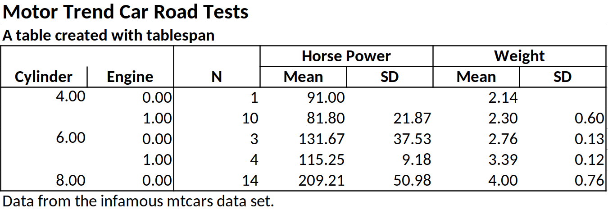

## Exporting to HTML, LaTeX, and RTF

Tables created with `tablespan` can also be exported to `gt` which allows saving as HTML, LaTeX, or RTF file. To this end, we simply have to call `as_gt` on our table:

```{r, include=FALSE}
# Translate to gt:
gt_tbl <- as_gt(tbl = tbl)
```
```{r, eval=FALSE}
# Translate to gt:
gt_tbl <- as_gt(tbl = tbl)
gt_tbl
```
<p align="center">
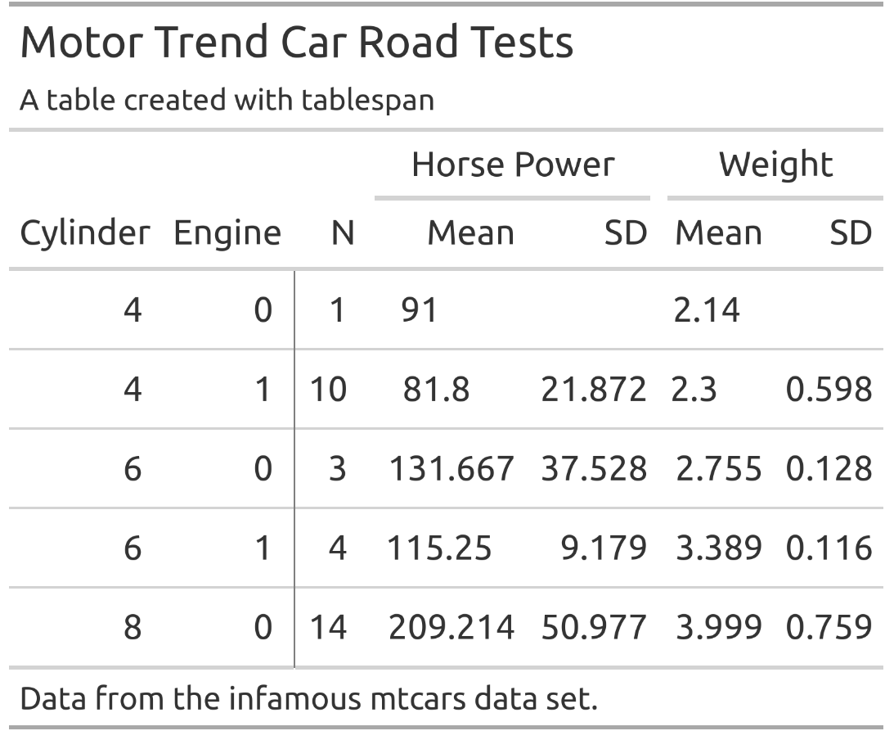
</p>

## Styling

`tablespan` allows adding styles to tables that are automatically exported to `gt` and `openxlsx`. The workflow is heavily inspired by `gt`.

All functions used to style `tablespan` tables start with `style_`:

- `style_title`: Adapt the style of the title
- `style_subtitle`: Adapt the style of the subtitle
- `style_header`: Adapt the style of the header
- `style_header_cells`: Stlye the header cells in openxlsx. Used to create the borders around header cells (only relevant for openxlsx exports)
- `style_column`: Add styling to the body of the table
- `style_footnote`: Adapt the style of the footnotes
- `style_vline`: Adapt the style of the vertical lines in the table. Only relevant for openxlsx
- `style_hline`: Adapt the style of the horizontal lines in the table. Only relevant for openxlsx

### Styling the title and subtitle

Use the `style_title` and `style_subtitle` options to style title and subtitle:

```{r, eval=FALSE}
tbl |> 
  style_title(background_color = "#000000",
              text_color = "#ffffff",
              bold = TRUE,
              italic = TRUE) |> 
  style_subtitle(italic = TRUE) |> 
  as_gt()
```
<p align="center">
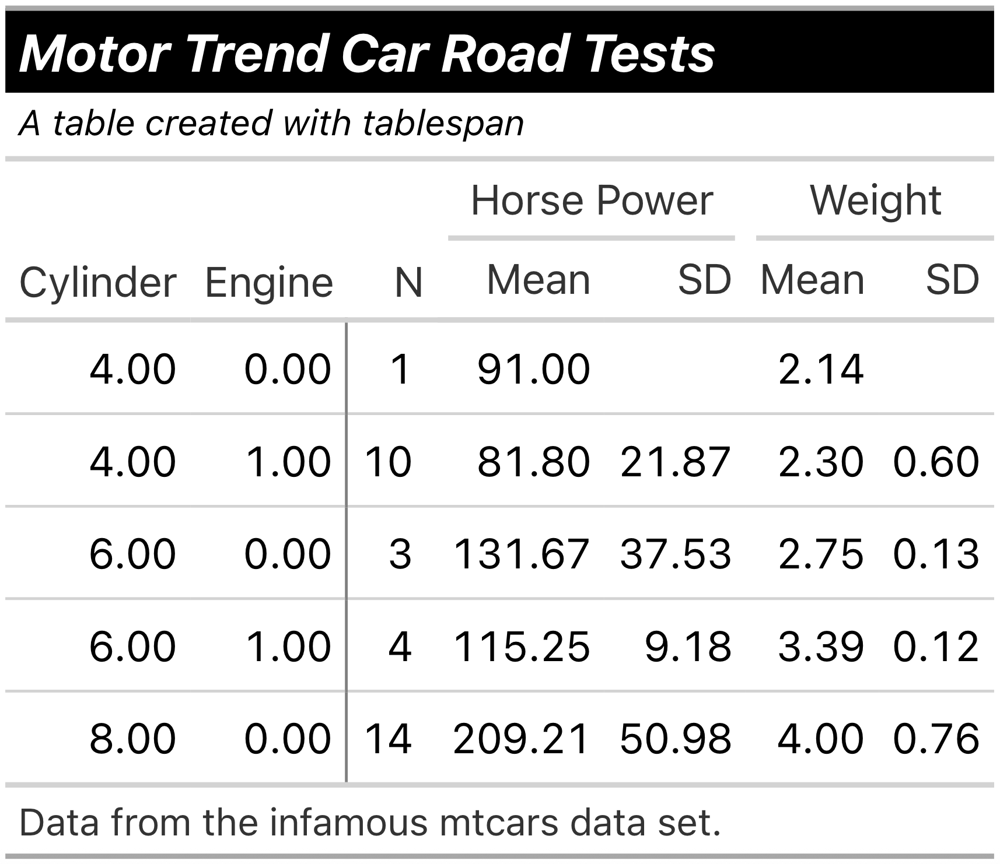
</p>

All of the styles applied in the following would also be exported to .xlsx files when using `as_excel` and saving the workbook with `openxlsx`.

### Styling the header

To adapt the header, use `style_header`:

```{r, eval=FALSE}
tbl |> 
  style_header(background_color = "#000000",
               text_color = "#ffffff",
               bold = TRUE,
               italic = TRUE) |> 
  as_gt()
```
<p align="center">
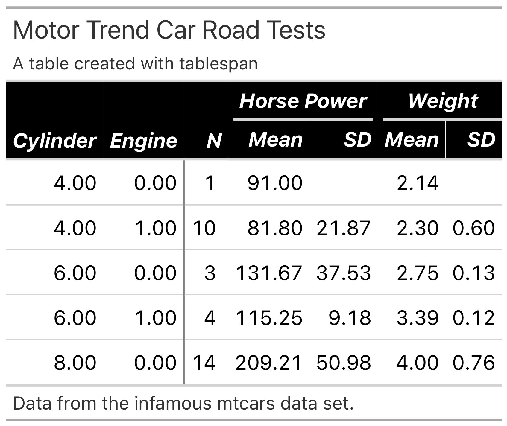
</p>

### Styling the body

The body is adapted with `style_column`. This function also allows styling only specific cells in the
body or styling multiple columns at once. Columns are selected with tidy expressions. Please note
that you will have to reference the columns with their respective names in the raw data set, not the names shown in the spanner:

```{r, eval = FALSE}
tbl |> 
  style_column(
    columns = starts_with("mean_"),
    rows = 2:3,
    background_color = "#000000",
    text_color = "#ffffff",
    bold = TRUE,
    italic = TRUE) |> 
  as_gt()
```
<p align="center">
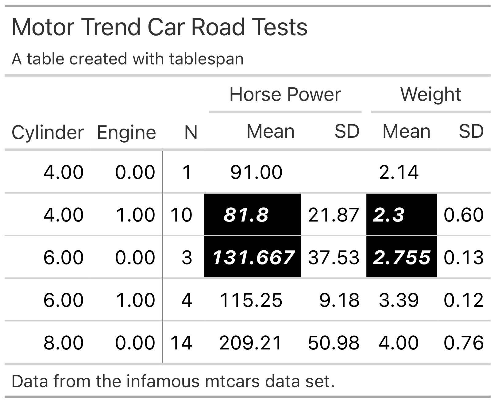
</p>

### Styling the footnote

```{r, eval = FALSE}
tbl |> 
  style_footnote(
    background_color = "#000000",
    text_color = "#ffffff",
    bold = TRUE,
    italic = TRUE) |> 
  as_gt()
```
<p align="center">
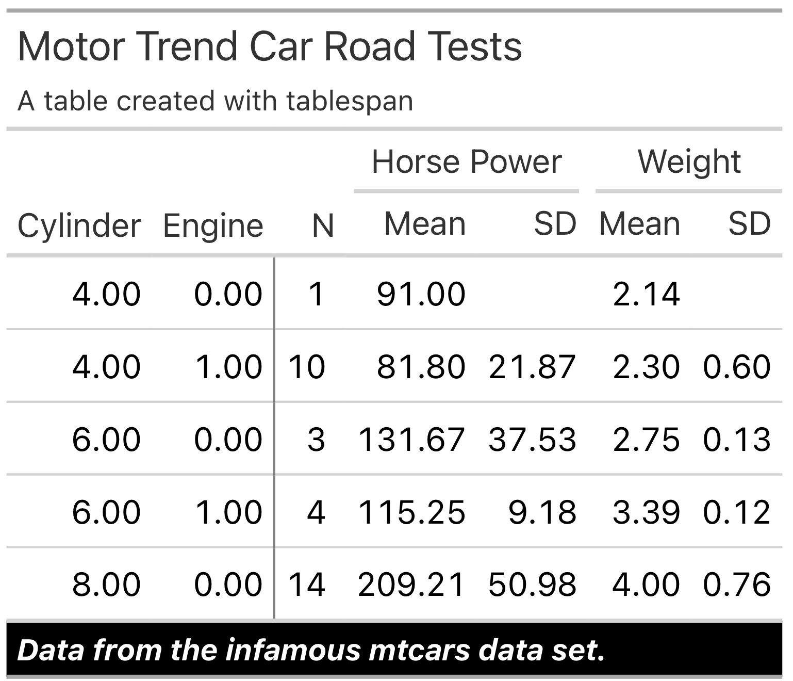
</p>

### Custom styles

The current interface only exports a small amount of the styles available in `gt` and `openxlsx`. However, you can also provide custom styles:

```{r, eval = FALSE}
tbl |> 
  style_column(
    columns = dplyr::where(is.double),
    # custom style for the gt table export:
    gt_style = gt::cell_text(decorate = "underline"),
    # custom style for the excel table export:
    openxlsx_style = openxlsx::createStyle(textDecoration = "underline")
  ) |> 
  as_gt()
```
<p align="center">
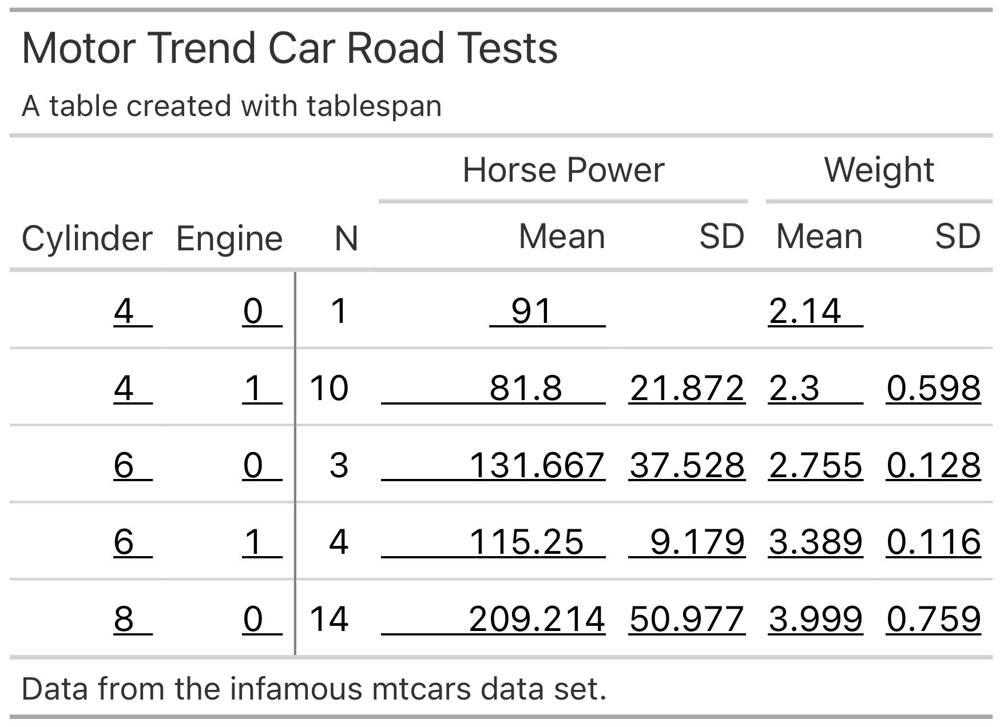
</p>

## Formatting

In addition to applying specific styles to the table, you can also adapt the number formatting.
The current setup is slightly more complicated because unifying all of the possible
styles supported by `gt` and `openxlsx` is challenging.

```{r, eval = FALSE}
tbl |> 
  format_column(
        columns = dplyr::where(is.double),
        rows = 2:3,
        # For great tables, we need a function that 
        # takes in the table, columns, and rows and then
        # applies the style
        format_gt = function(x, columns, rows, ...) {
          gt::fmt_number(x, columns = columns, rows = rows, decimals = 4)
        },
        # For openxlsx, we have to provide the style that will be passed
        # to numFmt in openxlsx::createStyle
        format_openxlsx = "0.0000"
      ) |> 
  as_gt()
```
<p align="center">
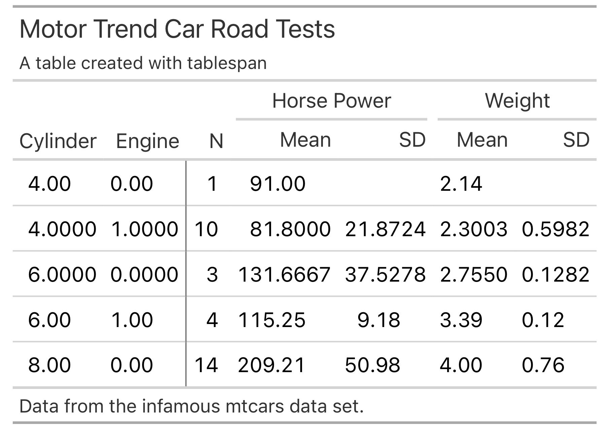
</p>


## Adapting Great Tables

The `gt` package provides a wide range of functions to adapt the style of the 
table created with `as_gt`. For instance, `opt_stylize` adds a pre-defined style 
to the entire table:

```{r, eval=FALSE}
gt_tbl |> 
  gt::opt_stylize(style = 6,
                  color = 'gray')
```

<p align="center">
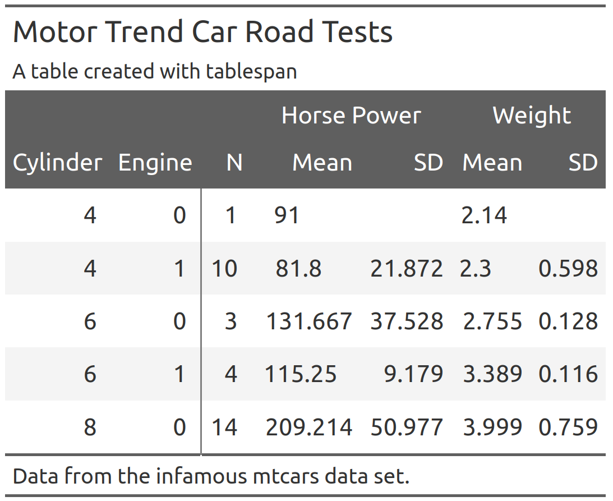
</p>

When adapting the `gt` object, there is an important detail to keep in mind: To 
ensure that each table spanner has a unique ID, `tablespan` will create IDs that
differ from the text shown in the spanner. To demonstrate this, Let's assume
that we want to add a spanner above `Horse Power` and `Weight`:
```{r, error=TRUE}
gt_tbl |> 
  gt::tab_spanner(label = "New Spanner", 
                  spanners = c("Horse Power", "Weight"))
```

This will throw an error because the spanner IDs are different from the spanner labels.
To get the spanner IDs, use `gt::tab_info()`:

```{r, eval = FALSE}
gt_tbl |> 
  gt::tab_info()
```
<p align="center">
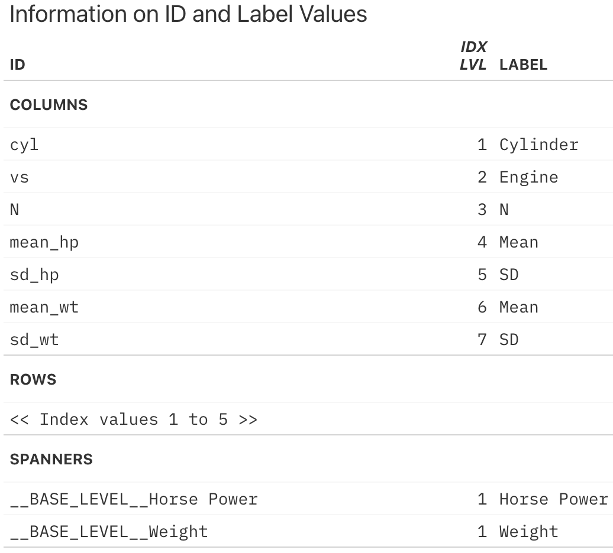
</p>

The IDs for the spanners can be found at the very bottom. To add another spanner
above `Horse Power` and `Weight`, we have to use these IDs:
```{r, eval=FALSE}
gt_tbl |> 
  gt::tab_spanner(label = "New Spanner", 
                  spanners = c("__BASE_LEVEL__Horse Power", 
                               "__BASE_LEVEL__Weight"))
```

<p align="center">
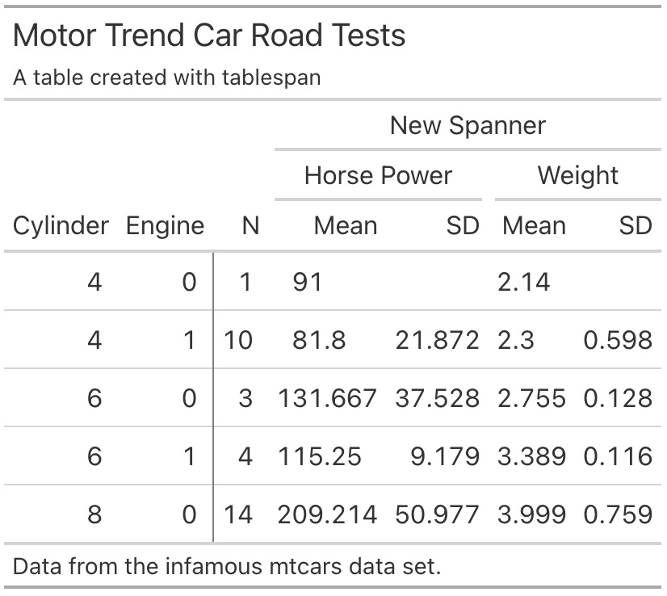
</p>


## References

- gt: Iannone R, Cheng J, Schloerke B, Hughes E, Lauer A, Seo J, Brevoort K, Roy O (2024). gt: Easily Create Presentation-Ready Display Tables. R package version 0.11.1.9000, <https://github.com/rstudio/gt>, <https://gt.rstudio.com>.
- expss: Gregory D et al. (2024). expss: Tables with Labels in R. R package version 0.9.31, <https://gdemin.github.io/expss/>. 
- tables: Murdoch D (2024). tables: Formula-Driven Table Generation. R package version 0.9.31, <https://dmurdoch.github.io/tables/>. 
- openxlsx: Schauberger P, Walker A (2023). _openxlsx: Read, Write and Edit xlsx Files_. R package version 4.2.5.2,
<https://ycphs.github.io/openxlsx/>.
