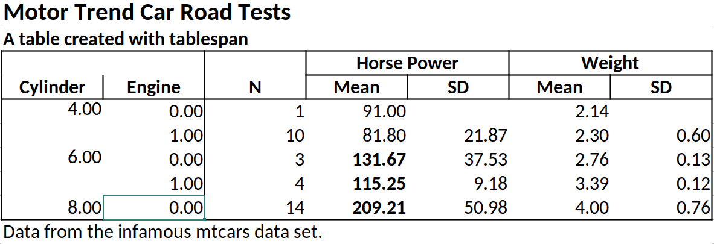
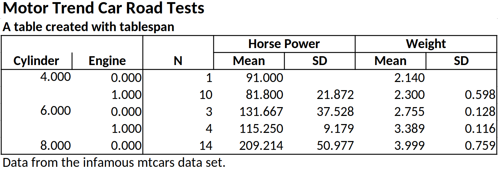

<!-- README.md is generated from README.Rmd. Please edit that file -->

# tablespan

> Create satisficing tables in R the formula way.

The objective of `tablespan` is to provide a “good enough” approach to
creating tables in R with simple formulas (inspired by
[`tables`](https://dmurdoch.github.io/tables/)). To this end,
`tablespan` builds on the awesome packages
[`openxlsx`](https://ycphs.github.io/openxlsx/) and
[`gt`](https://gt.rstudio.com/).

Tables created with `tablespan` can be exported to:

1.  **Excel** (using [`openxlsx`](https://ycphs.github.io/openxlsx/))
2.  **HTML** (using [`gt`](https://gt.rstudio.com/))
3.  **LaTeX** (using [`gt`](https://gt.rstudio.com/))
4.  **RTF** (using [`gt`](https://gt.rstudio.com/))

## Installation

`tablespan` is not yet available from CRAN. To install from GitHub, run
the following lines:

``` r
library(remotes)
remotes::install_github("jhorzek/tablespan")
```

## Introduction

`tablespan` assumes that you already have a perfectly summarized table
that you now want to share. All you need are some **table** headers with
**spanners** without investing much time into making it look perfect.
This is what `tablespan` was designed for.

Let’s assume we want to share the following table:

``` r
library(dplyr)
data("mtcars")

summarized_table <- mtcars |>
  group_by(cyl, vs) |>
  summarise(N = n(),
            mean_hp = mean(hp),
            sd_hp = sd(hp),
            mean_wt = mean(wt),
            sd_wt = sd(wt))
#> `summarise()` has grouped output by 'cyl'. You can override using the `.groups`
#> argument.

print(summarized_table)
#> # A tibble: 5 × 7
#> # Groups:   cyl [3]
#>     cyl    vs     N mean_hp sd_hp mean_wt  sd_wt
#>   <dbl> <dbl> <int>   <dbl> <dbl>   <dbl>  <dbl>
#> 1     4     0     1    91   NA       2.14 NA    
#> 2     4     1    10    81.8 21.9     2.30  0.598
#> 3     6     0     3   132.  37.5     2.76  0.128
#> 4     6     1     4   115.   9.18    3.39  0.116
#> 5     8     0    14   209.  51.0     4.00  0.759
```

Now we want to create a table where we show the grouping variables as
row names and also create spanners for the horse power (`hp`) and the
weight (`wt`) variables. The result should look something like this:

    |                   | Horse Power |   Weight  |
    | Cylinder | Engine | Mean  |  SD | Mean | SD |
    | -------- | ------ | ----- | --- | ---- | -- |
    |                   |                         |

### Creating a Basic Table

In `tablespan`, the table headers are defined with a formula approach
inspired by the [`tables`](https://dmurdoch.github.io/tables/) package.
For example, `cyl ~ mean_hp + sd_hp` defines a table with `cyl` as the
row names and `mean_hp` and `sd_hp` as columns. The output will look as
follows:

``` r
library(tablespan)
tablespan(data = summarized_table,
          formula = cyl ~ mean_hp + sd_hp)
#>                         
#>  | cyl | mean_hp sd_hp |
#>  | --- - ------- ----- |
#>  | 4   | 91            |
#>  | 4   | 81.8    21.87 |
#>  | 6   | 131.67  37.53 |
#>  | ... | ...     ...   |
```

Note that the row names (`cyl`) are in a separate block to the left.

### Adding Spanners

Spanners are defined using braces and spanner names. For example, the
following defines a spanner for `mean_hp` and `sd_hp` with the name
`Horsepower`: `cyl ~ (Horsepower = mean_hp + sd_hp)`.

``` r
tablespan(data = summarized_table,
          formula = cyl ~ (Horsepower = mean_hp + sd_hp))
#>                            
#>  |     | Horsepower       |
#>  | cyl | mean_hp    sd_hp |
#>  | --- - ---------- ----- |
#>  | 4   | 91               |
#>  | 4   | 81.8       21.87 |
#>  | 6   | 131.67     37.53 |
#>  | ... | ...        ...   |
```

Spanners can also be nested (e.g.,
`cyl ~ (Horsepower = (Mean = mean_hp) + (SD  = sd_hp))`.

``` r
tablespan(data = summarized_table,
          formula = cyl ~ (Horsepower = (Mean = mean_hp) + (SD  = sd_hp)))
#>                            
#>  |     | Horsepower       |
#>  |     | Mean       SD    |
#>  | cyl | mean_hp    sd_hp |
#>  | --- - ---------- ----- |
#>  | 4   | 91               |
#>  | 4   | 81.8       21.87 |
#>  | 6   | 131.67     37.53 |
#>  | ... | ...        ...   |
```

### Renaming Columns

Variable names in an R `data.frame` are often very technical (e.g.,
`mean_hp` and `sd_hp`). When sharing the table, we may want to replace
those names. In the example above, we may want to replace `mean_hp` and
`sd_hp` with “Mean” and “SD”. In `tablespan` renaming variables is
achieved with `new_name:old_name`. For example,
`cyl ~ (Horsepower = Mean:mean_hp + SD:sd_hp)` renames `mean_hp` to
`Mean` and `sd_hp` to `SD`:

``` r
tablespan(data = summarized_table,
          formula = cyl ~ (Horsepower = Mean:mean_hp + SD:sd_hp))
#>                            
#>  |     | Horsepower       |
#>  | cyl | Mean       SD    |
#>  | --- - ---------- ----- |
#>  | 4   | 91               |
#>  | 4   | 81.8       21.87 |
#>  | 6   | 131.67     37.53 |
#>  | ... | ...        ...   |
```

### Creating the Full Table

The combination of row names, spanners, and renaming of variables allows
creating the full table as follows:

``` r
library(dplyr)
library(tablespan)
data("mtcars")

summarized_table <- mtcars |>
  group_by(cyl, vs) |>
  summarise(N = n(),
            mean_hp = mean(hp),
            sd_hp = sd(hp),
            mean_wt = mean(wt),
            sd_wt = sd(wt))
#> `summarise()` has grouped output by 'cyl'. You can override using the `.groups`
#> argument.

tbl <- tablespan(data = summarized_table,
                 formula = Cylinder:cyl + Engine:vs ~
                   N +
                   (`Horse Power` = Mean:mean_hp + SD:sd_hp) +
                   (`Weight` = Mean:mean_wt + SD:sd_wt),
                 title = "Motor Trend Car Road Tests",
                 subtitle = "A table created with tablespan",
                 footnote = "Data from the infamous mtcars data set.")
tbl
#> Motor Trend Car Road Tests
#> A table created with tablespan
#>                                                         
#>  |                 |     Horse Power       Weight      |
#>  | Cylinder Engine | N   Mean        SD    Mean   SD   |
#>  | -------- ------ - --  ----------- ----- ------ ---- |
#>  | 4        0      | 1   91                2.14        |
#>  | 4        1      | 10  81.8        21.87 2.3    0.6  |
#>  | 6        0      | 3   131.67      37.53 2.76   0.13 |
#>  | ...      ...    | ... ...         ...   ...    ...  |
#> Data from the infamous mtcars data set.
```

## Exporting to Excel

Tables created with `tablespan` can now be translated to xlsx tables
with [`openxlsx`](https://ycphs.github.io/openxlsx/) using the
`to_excel` function:

``` r
# to_excel creates an openxlsx workbook
wb <- to_excel(tbl = tbl)

# Save the workbook as an xlsx file:
# openxlsx::saveWorkbook(wb,
#                        file = "cars.xlsx", 
#                        overwrite = TRUE)
```


### Styling

While `tablespan` provides limited styling options, some elements can be
adjusted. For example, we may want to print some elements in bold or
format numbers differently. In `tablespan`, styling happens when
translating the table to an `openxlsx` workbook with `to_excel`. To this
end, `tablespan` provides a `styles` argument.

#### Formatting Cells

Let’s assume we want all `mean_hp` values with a value $\geq 100$ to be
printed in bold. To this end, we first create a new style object using
`openxlsx`:

``` r
bold <- openxlsx::createStyle(textDecoration = "bold")
```

Next, we create a cell style with `tablespan`:

``` r
hp_ge_100 <- cell_style(rows = which(summarized_table$mean_hp >= 100), 
                        colnames = "mean_hp", 
                        style = bold,
                        gridExpand = FALSE)
```

Note that we specify the indices of the rows that we want to be in bold
and the column name of the item.

Finally, we pass this style as part of a list to `to_excel`:

``` r
# to_excel creates an openxlsx workbook
wb <- to_excel(tbl = tbl, 
               styles = tbl_styles(cell_styles = list(hp_ge_100)))

# Save the workbook as an xlsx file:
# openxlsx::saveWorkbook(wb,
#                        file = "cars.xlsx", 
#                        overwrite = TRUE)
```



#### Formatting Data Types

`tablespan` also allows formatting specific data types. Let’s assume
that we want to round all doubles to 3 instead of the default four
digits. To this end, we use the `create_data_styles` function, where we
specify (1) a function that checks for the data type we want to style
(here `is.double`) and (2) a style for all columns that match that
style:

``` r
double_style <- create_data_styles(double = list(test = is.double, 
                                                 style = openxlsx::createStyle(numFmt = "0.000")))
wb <- to_excel(tbl = tbl, styles = tbl_styles(data_styles = double_style))

# Save the workbook as an xlsx file:
# openxlsx::saveWorkbook(wb,
#                        file = "cars.xlsx", 
#                        overwrite = TRUE)
```



## Exporting to HTML, LaTeX, and RTF

Tables created with `tablespan` can also be exported to `gt` which
allows saving as HTML, LaTeX, or RTF file. To this end, we simply have
to call `to_gt` on our table:

``` r
# Translate to gt:
gt_tbl <- to_gt(tbl = tbl)
gt_tbl
```

<p align="center">

</p>

The `gt` package provides a wide range of functions to adapt the style
of these tables. For instance, `opt_stylize` adds a pre-defined style to
the entire table:

``` r
gt_tbl |> 
  gt::opt_stylize(style = 6,
                  color = 'gray')
```

<p align="center">

</p>

## Tables without row names

Using `1` on the left hand side of the formula creates a table without
row names. For example, `1 ~ (Horsepower = Mean:mean_hp + SD:sd_hp)`
defines

``` r
tablespan(data = summarized_table,
          formula = 1 ~ (Horsepower = Mean:mean_hp + SD:sd_hp))
#>                      
#>  | Horsepower       |
#>  | Mean       SD    |
#>  | ---------- ----- |
#>  | 91               |
#>  | 81.8       21.87 |
#>  | 131.67     37.53 |
#>  | ...        ...   |
```

## References

- gt: Iannone R, Cheng J, Schloerke B, Hughes E, Lauer A, Seo J,
  Brevoort K, Roy O (2024). gt: Easily Create Presentation-Ready Display
  Tables. R package version 0.11.1.9000,
  <https://github.com/rstudio/gt>, <https://gt.rstudio.com>.
- expss: Gregory D et al. (2024). expss: Tables with Labels in R. R
  package version 0.9.31, <https://gdemin.github.io/expss/>.
- tables: Murdoch D (2024). tables: Formula-Driven Table Generation. R
  package version 0.9.31, <https://dmurdoch.github.io/tables/>.
- openxlsx: Schauberger P, Walker A (2023). *openxlsx: Read, Write and
  Edit xlsx Files*. R package version 4.2.5.2,
  <https://CRAN.R-project.org/package=openxlsx>.
