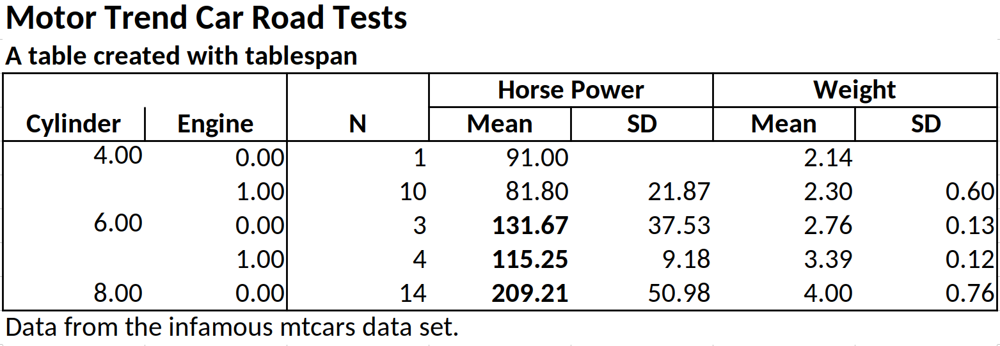

<!-- README.md is generated from README.Rmd. Please edit that file -->

# tablespan

<!-- badges: start -->

[](https://lifecycle.r-lib.org/articles/stages.html#experimental)
[](https://CRAN.R-project.org/package=tablespan)
[](https://cranlogs.r-pkg.org/badges/grand-total/tablespan)
<!-- badges: end -->

> Create satisficing tables in R the formula way.

The objective of `tablespan` is to provide a “good enough” approach to
creating tables by leveraging R’s formulas.

`tablespan` builds on the awesome packages
[`openxlsx`](https://ycphs.github.io/openxlsx/) and
[`gt`](https://gt.rstudio.com/), which allows tables created with
`tablespan` to be exported to the following formats:

1.  **Excel** (using [`openxlsx`](https://ycphs.github.io/openxlsx/))
2.  **HTML** (using [`gt`](https://gt.rstudio.com/))
3.  **LaTeX** (using [`gt`](https://gt.rstudio.com/))
4.  **RTF** (using [`gt`](https://gt.rstudio.com/))

## Installation

To install `tablespan` from CRAN use:

``` r
install.packages("tablespan")
```

The development version of `tablespan` can be installed from GitHub
with:

``` r
library(remotes)
remotes::install_github("jhorzek/tablespan")
```

## Introduction

R has a large set of great packages that allow you to create and export
tables that look exactly like you envisioned. However, sometimes you may
just need a good-enough table that is easy to create and share with
others. This is where `tablespan` can be of help.

Let’s assume that we want to share the following table:

``` r
library(dplyr)
data("mtcars")

summarized_table <- mtcars |>
  group_by(cyl, vs) |>
  summarise(N = n(),
            mean_hp = mean(hp),
            sd_hp = sd(hp),
            mean_wt = mean(wt),
            sd_wt = sd(wt))
#> `summarise()` has grouped output by 'cyl'. You can override using the `.groups`
#> argument.

print(summarized_table)
#> # A tibble: 5 × 7
#> # Groups:   cyl [3]
#>     cyl    vs     N mean_hp sd_hp mean_wt  sd_wt
#>   <dbl> <dbl> <int>   <dbl> <dbl>   <dbl>  <dbl>
#> 1     4     0     1    91   NA       2.14 NA    
#> 2     4     1    10    81.8 21.9     2.30  0.598
#> 3     6     0     3   132.  37.5     2.76  0.128
#> 4     6     1     4   115.   9.18    3.39  0.116
#> 5     8     0    14   209.  51.0     4.00  0.759
```

We don’t want to share the table as is - the variable names are all a
bit technical and the table could need some spanners summarizing
columns. So, we want to share a table that looks something like this:

    |                   | Horse Power |   Weight  |
    | Cylinder | Engine | Mean  |  SD | Mean | SD |
    | -------- | ------ | ----- | --- | ---- | -- |
    |                   |                         |

`tablespan` allows us to create this table with a single formula.

### Creating a Basic Table

In `tablespan`, the table headers are defined with a formula. For
example, `cyl ~ mean_hp + sd_hp` defines a table with `cyl` as the row
names and `mean_hp` and `sd_hp` as columns:

``` r
library(tablespan)
tablespan(data = summarized_table,
          formula = cyl ~ mean_hp + sd_hp)
#>                         
#>  | cyl | mean_hp sd_hp |
#>  | --- - ------- ----- |
#>  | 4   | 91            |
#>  | 4   | 81.8    21.87 |
#>  | 6   | 131.67  37.53 |
#>  | ... | ...     ...   |
```

Note that the row names (`cyl`) are in a separate block to the left.

### Adding Spanners

Spanners are defined using braces and spanner names. For example, the
following defines a spanner for `mean_hp` and `sd_hp` with the name
`Horsepower`: `cyl ~ (Horsepower = mean_hp + sd_hp)`:

``` r
tablespan(data = summarized_table,
          formula = cyl ~ (Horsepower = mean_hp + sd_hp))
#>                            
#>  |     | Horsepower       |
#>  | cyl | mean_hp    sd_hp |
#>  | --- - ---------- ----- |
#>  | 4   | 91               |
#>  | 4   | 81.8       21.87 |
#>  | 6   | 131.67     37.53 |
#>  | ... | ...        ...   |
```

Spanners can also be nested:

``` r
tablespan(data = summarized_table,
          formula = cyl ~ (Horsepower = (Mean = mean_hp) + (SD  = sd_hp)))
#>                            
#>  |     | Horsepower       |
#>  |     | Mean       SD    |
#>  | cyl | mean_hp    sd_hp |
#>  | --- - ---------- ----- |
#>  | 4   | 91               |
#>  | 4   | 81.8       21.87 |
#>  | 6   | 131.67     37.53 |
#>  | ... | ...        ...   |
```

### Renaming Columns

Variable names in an R `data.frame` are often very technical (e.g.,
`mean_hp` and `sd_hp`). When sharing the table, we may want to replace
those names. In the example above, we may want to replace `mean_hp` and
`sd_hp` with “Mean” and “SD”. In `tablespan` renaming variables is
achieved with `new_name:old_name`. For example,
`cyl ~ (Horsepower = Mean:mean_hp + SD:sd_hp)` renames `mean_hp` to
`Mean` and `sd_hp` to `SD`:

``` r
tablespan(data = summarized_table,
          formula = cyl ~ (Horsepower = Mean:mean_hp + SD:sd_hp))
#>                            
#>  |     | Horsepower       |
#>  | cyl | Mean       SD    |
#>  | --- - ---------- ----- |
#>  | 4   | 91               |
#>  | 4   | 81.8       21.87 |
#>  | 6   | 131.67     37.53 |
#>  | ... | ...        ...   |
```

### Creating the Full Table

The combination of row names, spanners, and renaming of variables allows
creating the full table:

``` r
library(dplyr)
library(tablespan)
data("mtcars")

summarized_table <- mtcars |>
  group_by(cyl, vs) |>
  summarise(N = n(),
            mean_hp = mean(hp),
            sd_hp = sd(hp),
            mean_wt = mean(wt),
            sd_wt = sd(wt))
#> `summarise()` has grouped output by 'cyl'. You can override using the `.groups`
#> argument.

tbl <- tablespan(data = summarized_table,
                 formula = Cylinder:cyl + Engine:vs ~
                   N +
                   (`Horse Power` = Mean:mean_hp + SD:sd_hp) +
                   (`Weight` = Mean:mean_wt + SD:sd_wt),
                 title = "Motor Trend Car Road Tests",
                 subtitle = "A table created with tablespan",
                 footnote = "Data from the infamous mtcars data set.")
tbl
#> Motor Trend Car Road Tests
#> A table created with tablespan
#>                                                         
#>  |                 |     Horse Power       Weight      |
#>  | Cylinder Engine | N   Mean        SD    Mean   SD   |
#>  | -------- ------ - --  ----------- ----- ------ ---- |
#>  | 4        0      | 1   91                2.14        |
#>  | 4        1      | 10  81.8        21.87 2.3    0.6  |
#>  | 6        0      | 3   131.67      37.53 2.76   0.13 |
#>  | ...      ...    | ... ...         ...   ...    ...  |
#> Data from the infamous mtcars data set.
```

## Exporting to Excel

Tables created with `tablespan` can now be translated to xlsx tables
with [`openxlsx`](https://ycphs.github.io/openxlsx/) using the
`as_excel` function:

``` r
# as_excel creates an openxlsx workbook
wb <- as_excel(tbl = tbl)

# Save the workbook as an xlsx file:
# openxlsx::saveWorkbook(wb,
#                        file = "cars.xlsx", 
#                        overwrite = TRUE)
```


### Styling

While `tablespan` provides limited styling options, some elements can be
adjusted. For example, we may want to print some elements in bold or
format numbers differently. In `tablespan`, styling happens when
translating the table to an `openxlsx` workbook with `as_excel`. To this
end, `tablespan` provides a `styles` argument.

#### Formatting Cells

Let’s assume we want all `mean_hp` values with a value $\geq 100$ to be
printed in bold. To this end, we first create a new style object using
`openxlsx`:

``` r
bold <- openxlsx::createStyle(textDecoration = "bold")
```

Next, we create a cell style with `tablespan`:

``` r
hp_ge_100 <- cell_style(rows = which(summarized_table$mean_hp >= 100), 
                        colnames = "mean_hp", 
                        style = bold,
                        gridExpand = FALSE)
```

Note that we specify the indices of the rows that we want to be in bold
and the column name of the item.

Finally, we pass this style as part of a list to `as_excel`:

``` r
# as_excel creates an openxlsx workbook
wb <- as_excel(tbl = tbl, 
               styles = tbl_styles(cell_styles = list(hp_ge_100)))

# Save the workbook as an xlsx file:
# openxlsx::saveWorkbook(wb,
#                        file = "cars.xlsx", 
#                        overwrite = TRUE)
```



#### Formatting Data Types

`tablespan` also allows formatting specific data types. Let’s assume
that we want to round all doubles to 3 instead of the default 2 digits.
To this end, we use the `create_data_styles` function, where we specify
(1) a function that checks for the data type we want to style (here
`is.double`) and (2) a style for all columns that match that style:

``` r
double_style <- create_data_styles(double = list(test = is.double, 
                                                 style = openxlsx::createStyle(numFmt = "0.000")))
wb <- as_excel(tbl = tbl, styles = tbl_styles(data_styles = double_style))

# Save the workbook as an xlsx file:
# openxlsx::saveWorkbook(wb,
#                        file = "cars.xlsx", 
#                        overwrite = TRUE)
```


## Exporting to HTML, LaTeX, and RTF

Tables created with `tablespan` can also be exported to `gt` which
allows saving as HTML, LaTeX, or RTF file. To this end, we simply have
to call `as_gt` on our table:

``` r
# Translate to gt:
gt_tbl <- as_gt(tbl = tbl)
gt_tbl
```

<p align="center">

</p>

### Styling Great Tables

The `gt` package provides a wide range of functions to adapt the style
of the table created with `as_gt`. For instance, `opt_stylize` adds a
pre-defined style to the entire table:

``` r
gt_tbl |> 
  gt::opt_stylize(style = 6,
                  color = 'gray')
```

<p align="center">

</p>

When adapting the `gt` object, there is an important detail to keep in
mind: To ensure that each table spanner has a unique ID, `tablespan`
will create IDs that differ from the text shown in the spanner. To
demonstrate this, Let’s assume that we want to add a spanner above
`Horse Power` and `Weight`:

``` r
gt_tbl |> 
  gt::tab_spanner(label = "New Spanner", 
                  spanners = c("Horse Power", "Weight"))
#> Error in `gt::tab_spanner()`:
#> ! One or more spanner ID(s) supplied in `spanners` (Horse Power and
#>   Weight), for the new spanner with the ID `New Spanner` doesn't belong to any
#>   existing spanners.
```

This will throw an error because the spanner IDs are different from the
spanner labels. To get the spanner IDs, use `gt::tab_info()`:

``` r
gt_tbl |> 
  gt::tab_info()
```

<p align="center">

</p>

The IDs for the spanners can be found at the very bottom. To add another
spanner above `Horse Power` and `Weight`, we have to use these IDs:

``` r
gt_tbl |> 
  gt::tab_spanner(label = "New Spanner", 
                  spanners = c("__BASE_LEVEL__Horse Power", 
                               "__BASE_LEVEL__Weight"))
```

<p align="center">

</p>

## Tables without row names

Using `1` on the left hand side of the formula creates a table without
row names. For example, `1 ~ (Horsepower = Mean:mean_hp + SD:sd_hp)`
defines

``` r
tablespan(data = summarized_table,
          formula = 1 ~ (Horsepower = Mean:mean_hp + SD:sd_hp))
#>                      
#>  | Horsepower       |
#>  | Mean       SD    |
#>  | ---------- ----- |
#>  | 91               |
#>  | 81.8       21.87 |
#>  | 131.67     37.53 |
#>  | ...        ...   |
```

## References

- gt: Iannone R, Cheng J, Schloerke B, Hughes E, Lauer A, Seo J,
  Brevoort K, Roy O (2024). gt: Easily Create Presentation-Ready Display
  Tables. R package version 0.11.1.9000,
  <https://github.com/rstudio/gt>, <https://gt.rstudio.com>.
- expss: Gregory D et al. (2024). expss: Tables with Labels in R. R
  package version 0.9.31, <https://gdemin.github.io/expss/>.
- tables: Murdoch D (2024). tables: Formula-Driven Table Generation. R
  package version 0.9.31, <https://dmurdoch.github.io/tables/>.
- openxlsx: Schauberger P, Walker A (2023). *openxlsx: Read, Write and
  Edit xlsx Files*. R package version 4.2.5.2,
  <https://ycphs.github.io/openxlsx/>.
