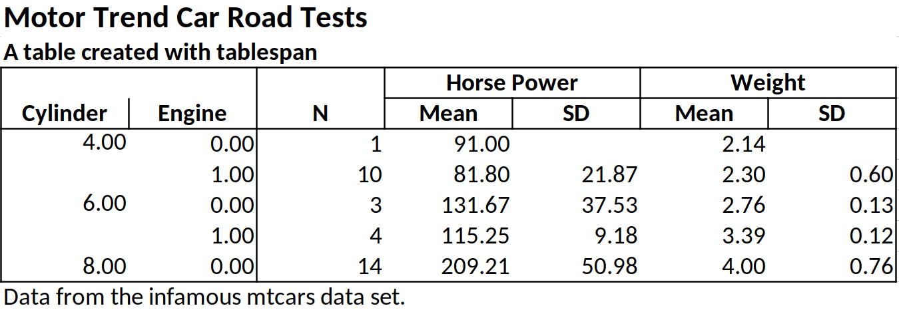
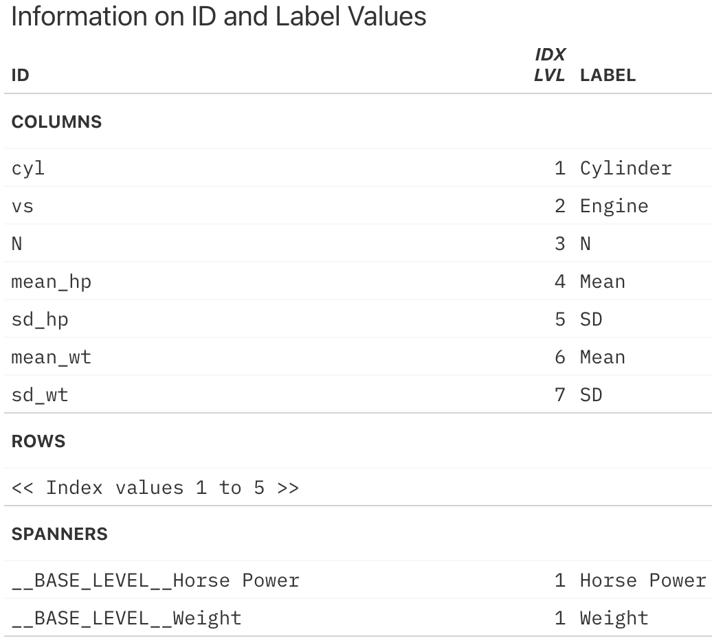

<!-- README.md is generated from README.Rmd. Please edit that file -->

# tablespan

<!-- badges: start -->

[](https://lifecycle.r-lib.org/articles/stages.html#experimental)
[](https://CRAN.R-project.org/package=tablespan)
[](https://cranlogs.r-pkg.org/badges/grand-total/tablespan)
<!-- badges: end -->

> Create satisficing tables in R the formula way.

The objective of `tablespan` is to provide a “good enough” approach to
creating tables by leveraging R’s formulas:

``` r
library(dplyr)
library(tablespan)
data("mtcars")

summarized_table <- mtcars |>
  group_by(cyl, vs) |>
  summarise(N = n(),
            mean_hp = mean(hp),
            sd_hp = sd(hp),
            mean_wt = mean(wt),
            sd_wt = sd(wt))
#> `summarise()` has grouped output by 'cyl'. You can override using the `.groups`
#> argument.

tbl <- tablespan(data = summarized_table,
                 formula = Cylinder:cyl + Engine:vs ~
                   N +
                   (`Horse Power` = Mean:mean_hp + SD:sd_hp) +
                   (`Weight` = Mean:mean_wt + SD:sd_wt),
                 title = "Motor Trend Car Road Tests",
                 subtitle = "A table created with tablespan",
                 footnote = "Data from the infamous mtcars data set.")
tbl
#> Motor Trend Car Road Tests
#> A table created with tablespan
#>                                                         
#>  |                 |     Horse Power       Weight      |
#>  | Cylinder Engine | N   Mean        SD    Mean   SD   |
#>  | -------- ------ - --  ----------- ----- ------ ---- |
#>  | 4        0      | 1   91                2.14        |
#>  | 4        1      | 10  81.8        21.87 2.3    0.6  |
#>  | 6        0      | 3   131.67      37.53 2.76   0.13 |
#>  | ...      ...    | ... ...         ...   ...    ...  |
#> Data from the infamous mtcars data set.
```

`tablespan` builds on the awesome packages
[`openxlsx`](https://ycphs.github.io/openxlsx/) and
[`gt`](https://gt.rstudio.com/), which allows tables created with
`tablespan` to be exported to the following formats:

1.  **Excel** (using [`openxlsx`](https://ycphs.github.io/openxlsx/))
2.  **HTML** (using [`gt`](https://gt.rstudio.com/))
3.  **LaTeX** (using [`gt`](https://gt.rstudio.com/))
4.  **RTF** (using [`gt`](https://gt.rstudio.com/))

## Installation

To install `tablespan` from CRAN use:

``` r
install.packages("tablespan")
```

The development version of `tablespan` can be installed from GitHub
with:

``` r
library(remotes)
remotes::install_github("jhorzek/tablespan")
```

## Introduction

R has a large set of great packages that allow you to create and export
tables that look exactly like you envisioned. However, sometimes you may
just need a good-enough table that is easy to create and share with
others. This is where `tablespan` can be of help.

Let’s assume that we want to share the following table:

``` r
library(dplyr)
data("mtcars")

summarized_table <- mtcars |>
  group_by(cyl, vs) |>
  summarise(N = n(),
            mean_hp = mean(hp),
            sd_hp = sd(hp),
            mean_wt = mean(wt),
            sd_wt = sd(wt))
#> `summarise()` has grouped output by 'cyl'. You can override using the `.groups`
#> argument.

print(summarized_table)
#> # A tibble: 5 × 7
#> # Groups:   cyl [3]
#>     cyl    vs     N mean_hp sd_hp mean_wt  sd_wt
#>   <dbl> <dbl> <int>   <dbl> <dbl>   <dbl>  <dbl>
#> 1     4     0     1    91   NA       2.14 NA    
#> 2     4     1    10    81.8 21.9     2.30  0.598
#> 3     6     0     3   132.  37.5     2.76  0.128
#> 4     6     1     4   115.   9.18    3.39  0.116
#> 5     8     0    14   209.  51.0     4.00  0.759
```

We don’t want to share the table as is - the variable names are all a
bit technical and the table could need some spanners summarizing
columns. So, we want to share a table that looks something like this:

    |                   | Horse Power |   Weight  |
    | Cylinder | Engine | Mean  |  SD | Mean | SD |
    | -------- | ------ | ----- | --- | ---- | -- |
    |                   |                         |

`tablespan` allows us to create this table with a single formula.

### Creating a Basic Table

In `tablespan`, the table headers are defined with a formula. For
example, `cyl ~ mean_hp + sd_hp` defines a table with `cyl` as the row
names and `mean_hp` and `sd_hp` as columns:

``` r
library(tablespan)
tablespan(data = summarized_table,
          formula = cyl ~ mean_hp + sd_hp)
#>                         
#>  | cyl | mean_hp sd_hp |
#>  | --- - ------- ----- |
#>  | 4   | 91            |
#>  | 4   | 81.8    21.87 |
#>  | 6   | 131.67  37.53 |
#>  | ... | ...     ...   |
```

Note that the row names (`cyl`) are in a separate block to the left.

### Adding Spanners

Spanners are defined using braces and spanner names. For example, the
following defines a spanner for `mean_hp` and `sd_hp` with the name
`Horsepower`: `cyl ~ (Horsepower = mean_hp + sd_hp)`:

``` r
tablespan(data = summarized_table,
          formula = cyl ~ (Horsepower = mean_hp + sd_hp))
#>                            
#>  |     | Horsepower       |
#>  | cyl | mean_hp    sd_hp |
#>  | --- - ---------- ----- |
#>  | 4   | 91               |
#>  | 4   | 81.8       21.87 |
#>  | 6   | 131.67     37.53 |
#>  | ... | ...        ...   |
```

Spanners can also be nested:

``` r
tablespan(data = summarized_table,
          formula = cyl ~ (Horsepower = (Mean = mean_hp) + (SD  = sd_hp)))
#>                            
#>  |     | Horsepower       |
#>  |     | Mean       SD    |
#>  | cyl | mean_hp    sd_hp |
#>  | --- - ---------- ----- |
#>  | 4   | 91               |
#>  | 4   | 81.8       21.87 |
#>  | 6   | 131.67     37.53 |
#>  | ... | ...        ...   |
```

### Renaming Columns

Variable names in an R `data.frame` are often very technical (e.g.,
`mean_hp` and `sd_hp`). When sharing the table, we may want to replace
those names. In the example above, we may want to replace `mean_hp` and
`sd_hp` with “Mean” and “SD”. In `tablespan` renaming variables is
achieved with `new_name:old_name`. For example,
`cyl ~ (Horsepower = Mean:mean_hp + SD:sd_hp)` renames `mean_hp` to
`Mean` and `sd_hp` to `SD`:

``` r
tablespan(data = summarized_table,
          formula = cyl ~ (Horsepower = Mean:mean_hp + SD:sd_hp))
#>                            
#>  |     | Horsepower       |
#>  | cyl | Mean       SD    |
#>  | --- - ---------- ----- |
#>  | 4   | 91               |
#>  | 4   | 81.8       21.87 |
#>  | 6   | 131.67     37.53 |
#>  | ... | ...        ...   |
```

### Creating the Full Table

The combination of row names, spanners, and renaming of variables allows
creating the full table:

``` r
library(dplyr)
library(tablespan)
data("mtcars")

summarized_table <- mtcars |>
  group_by(cyl, vs) |>
  summarise(N = n(),
            mean_hp = mean(hp),
            sd_hp = sd(hp),
            mean_wt = mean(wt),
            sd_wt = sd(wt))
#> `summarise()` has grouped output by 'cyl'. You can override using the `.groups`
#> argument.

tbl <- tablespan(data = summarized_table,
                 formula = Cylinder:cyl + Engine:vs ~
                   N +
                   (`Horse Power` = Mean:mean_hp + SD:sd_hp) +
                   (`Weight` = Mean:mean_wt + SD:sd_wt),
                 title = "Motor Trend Car Road Tests",
                 subtitle = "A table created with tablespan",
                 footnote = "Data from the infamous mtcars data set.")
tbl
#> Motor Trend Car Road Tests
#> A table created with tablespan
#>                                                         
#>  |                 |     Horse Power       Weight      |
#>  | Cylinder Engine | N   Mean        SD    Mean   SD   |
#>  | -------- ------ - --  ----------- ----- ------ ---- |
#>  | 4        0      | 1   91                2.14        |
#>  | 4        1      | 10  81.8        21.87 2.3    0.6  |
#>  | 6        0      | 3   131.67      37.53 2.76   0.13 |
#>  | ...      ...    | ... ...         ...   ...    ...  |
#> Data from the infamous mtcars data set.
```

## Exporting to Excel

Tables created with `tablespan` can now be translated to xlsx tables
with [`openxlsx`](https://ycphs.github.io/openxlsx/) using the
`as_excel` function:

``` r
# as_excel creates an openxlsx workbook
wb <- as_excel(tbl = tbl)

# Save the workbook as an xlsx file:
# openxlsx::saveWorkbook(wb,
#                        file = "cars.xlsx", 
#                        overwrite = TRUE)
```



## Exporting to HTML, LaTeX, and RTF

Tables created with `tablespan` can also be exported to `gt` which
allows saving as HTML, LaTeX, or RTF file. To this end, we simply have
to call `as_gt` on our table:

``` r
# Translate to gt:
gt_tbl <- as_gt(tbl = tbl)
gt_tbl
```

<p align="center">

</p>

## Styling

`tablespan` allows adding styles to tables that are automatically
exported to `gt` and `openxlsx`. The workflow is heavily inspired by
`gt`.

All functions used to style `tablespan` tables start with `style_`:

### Styling the tile and subtitle

Use the `style_title` and `style_subtitle` options to style title and
subtitle:

``` r
tbl |> 
  style_title(background_color = "#000000",
              text_color = "#ffffff",
              bold = TRUE,
              italic = TRUE) |> 
  style_subtitle(italic = TRUE) |> 
  as_gt()
```

<div id="fmximggbsa" style="padding-left:0px;padding-right:0px;padding-top:10px;padding-bottom:10px;overflow-x:auto;overflow-y:auto;width:auto;height:auto;">
<style>#fmximggbsa table {
  font-family: system-ui, 'Segoe UI', Roboto, Helvetica, Arial, sans-serif, 'Apple Color Emoji', 'Segoe UI Emoji', 'Segoe UI Symbol', 'Noto Color Emoji';
  -webkit-font-smoothing: antialiased;
  -moz-osx-font-smoothing: grayscale;
}
&#10;#fmximggbsa thead, #fmximggbsa tbody, #fmximggbsa tfoot, #fmximggbsa tr, #fmximggbsa td, #fmximggbsa th {
  border-style: none;
}
&#10;#fmximggbsa p {
  margin: 0;
  padding: 0;
}
&#10;#fmximggbsa .gt_table {
  display: table;
  border-collapse: collapse;
  line-height: normal;
  margin-left: auto;
  margin-right: auto;
  color: #333333;
  font-size: 16px;
  font-weight: normal;
  font-style: normal;
  background-color: #FFFFFF;
  width: auto;
  border-top-style: solid;
  border-top-width: 2px;
  border-top-color: #A8A8A8;
  border-right-style: none;
  border-right-width: 2px;
  border-right-color: #D3D3D3;
  border-bottom-style: solid;
  border-bottom-width: 2px;
  border-bottom-color: #A8A8A8;
  border-left-style: none;
  border-left-width: 2px;
  border-left-color: #D3D3D3;
}
&#10;#fmximggbsa .gt_caption {
  padding-top: 4px;
  padding-bottom: 4px;
}
&#10;#fmximggbsa .gt_title {
  color: #333333;
  font-size: 125%;
  font-weight: initial;
  padding-top: 4px;
  padding-bottom: 4px;
  padding-left: 5px;
  padding-right: 5px;
  border-bottom-color: #FFFFFF;
  border-bottom-width: 0;
}
&#10;#fmximggbsa .gt_subtitle {
  color: #333333;
  font-size: 85%;
  font-weight: initial;
  padding-top: 3px;
  padding-bottom: 5px;
  padding-left: 5px;
  padding-right: 5px;
  border-top-color: #FFFFFF;
  border-top-width: 0;
}
&#10;#fmximggbsa .gt_heading {
  background-color: #FFFFFF;
  text-align: left;
  border-bottom-color: #FFFFFF;
  border-left-style: none;
  border-left-width: 1px;
  border-left-color: #D3D3D3;
  border-right-style: none;
  border-right-width: 1px;
  border-right-color: #D3D3D3;
}
&#10;#fmximggbsa .gt_bottom_border {
  border-bottom-style: solid;
  border-bottom-width: 2px;
  border-bottom-color: #D3D3D3;
}
&#10;#fmximggbsa .gt_col_headings {
  border-top-style: solid;
  border-top-width: 2px;
  border-top-color: #D3D3D3;
  border-bottom-style: solid;
  border-bottom-width: 2px;
  border-bottom-color: #D3D3D3;
  border-left-style: none;
  border-left-width: 1px;
  border-left-color: #D3D3D3;
  border-right-style: none;
  border-right-width: 1px;
  border-right-color: #D3D3D3;
}
&#10;#fmximggbsa .gt_col_heading {
  color: #333333;
  background-color: #FFFFFF;
  font-size: 100%;
  font-weight: normal;
  text-transform: inherit;
  border-left-style: none;
  border-left-width: 1px;
  border-left-color: #D3D3D3;
  border-right-style: none;
  border-right-width: 1px;
  border-right-color: #D3D3D3;
  vertical-align: bottom;
  padding-top: 5px;
  padding-bottom: 6px;
  padding-left: 5px;
  padding-right: 5px;
  overflow-x: hidden;
}
&#10;#fmximggbsa .gt_column_spanner_outer {
  color: #333333;
  background-color: #FFFFFF;
  font-size: 100%;
  font-weight: normal;
  text-transform: inherit;
  padding-top: 0;
  padding-bottom: 0;
  padding-left: 4px;
  padding-right: 4px;
}
&#10;#fmximggbsa .gt_column_spanner_outer:first-child {
  padding-left: 0;
}
&#10;#fmximggbsa .gt_column_spanner_outer:last-child {
  padding-right: 0;
}
&#10;#fmximggbsa .gt_column_spanner {
  border-bottom-style: solid;
  border-bottom-width: 2px;
  border-bottom-color: #D3D3D3;
  vertical-align: bottom;
  padding-top: 5px;
  padding-bottom: 5px;
  overflow-x: hidden;
  display: inline-block;
  width: 100%;
}
&#10;#fmximggbsa .gt_spanner_row {
  border-bottom-style: hidden;
}
&#10;#fmximggbsa .gt_group_heading {
  padding-top: 8px;
  padding-bottom: 8px;
  padding-left: 5px;
  padding-right: 5px;
  color: #333333;
  background-color: #FFFFFF;
  font-size: 100%;
  font-weight: initial;
  text-transform: inherit;
  border-top-style: solid;
  border-top-width: 2px;
  border-top-color: #D3D3D3;
  border-bottom-style: solid;
  border-bottom-width: 2px;
  border-bottom-color: #D3D3D3;
  border-left-style: none;
  border-left-width: 1px;
  border-left-color: #D3D3D3;
  border-right-style: none;
  border-right-width: 1px;
  border-right-color: #D3D3D3;
  vertical-align: middle;
  text-align: left;
}
&#10;#fmximggbsa .gt_empty_group_heading {
  padding: 0.5px;
  color: #333333;
  background-color: #FFFFFF;
  font-size: 100%;
  font-weight: initial;
  border-top-style: solid;
  border-top-width: 2px;
  border-top-color: #D3D3D3;
  border-bottom-style: solid;
  border-bottom-width: 2px;
  border-bottom-color: #D3D3D3;
  vertical-align: middle;
}
&#10;#fmximggbsa .gt_from_md > :first-child {
  margin-top: 0;
}
&#10;#fmximggbsa .gt_from_md > :last-child {
  margin-bottom: 0;
}
&#10;#fmximggbsa .gt_row {
  padding-top: 8px;
  padding-bottom: 8px;
  padding-left: 5px;
  padding-right: 5px;
  margin: 10px;
  border-top-style: solid;
  border-top-width: 1px;
  border-top-color: #D3D3D3;
  border-left-style: none;
  border-left-width: 1px;
  border-left-color: #D3D3D3;
  border-right-style: none;
  border-right-width: 1px;
  border-right-color: #D3D3D3;
  vertical-align: middle;
  overflow-x: hidden;
}
&#10;#fmximggbsa .gt_stub {
  color: #333333;
  background-color: #FFFFFF;
  font-size: 100%;
  font-weight: initial;
  text-transform: inherit;
  border-right-style: solid;
  border-right-width: 2px;
  border-right-color: #D3D3D3;
  padding-left: 5px;
  padding-right: 5px;
}
&#10;#fmximggbsa .gt_stub_row_group {
  color: #333333;
  background-color: #FFFFFF;
  font-size: 100%;
  font-weight: initial;
  text-transform: inherit;
  border-right-style: solid;
  border-right-width: 2px;
  border-right-color: #D3D3D3;
  padding-left: 5px;
  padding-right: 5px;
  vertical-align: top;
}
&#10;#fmximggbsa .gt_row_group_first td {
  border-top-width: 2px;
}
&#10;#fmximggbsa .gt_row_group_first th {
  border-top-width: 2px;
}
&#10;#fmximggbsa .gt_summary_row {
  color: #333333;
  background-color: #FFFFFF;
  text-transform: inherit;
  padding-top: 8px;
  padding-bottom: 8px;
  padding-left: 5px;
  padding-right: 5px;
}
&#10;#fmximggbsa .gt_first_summary_row {
  border-top-style: solid;
  border-top-color: #D3D3D3;
}
&#10;#fmximggbsa .gt_first_summary_row.thick {
  border-top-width: 2px;
}
&#10;#fmximggbsa .gt_last_summary_row {
  padding-top: 8px;
  padding-bottom: 8px;
  padding-left: 5px;
  padding-right: 5px;
  border-bottom-style: solid;
  border-bottom-width: 2px;
  border-bottom-color: #D3D3D3;
}
&#10;#fmximggbsa .gt_grand_summary_row {
  color: #333333;
  background-color: #FFFFFF;
  text-transform: inherit;
  padding-top: 8px;
  padding-bottom: 8px;
  padding-left: 5px;
  padding-right: 5px;
}
&#10;#fmximggbsa .gt_first_grand_summary_row {
  padding-top: 8px;
  padding-bottom: 8px;
  padding-left: 5px;
  padding-right: 5px;
  border-top-style: double;
  border-top-width: 6px;
  border-top-color: #D3D3D3;
}
&#10;#fmximggbsa .gt_last_grand_summary_row_top {
  padding-top: 8px;
  padding-bottom: 8px;
  padding-left: 5px;
  padding-right: 5px;
  border-bottom-style: double;
  border-bottom-width: 6px;
  border-bottom-color: #D3D3D3;
}
&#10;#fmximggbsa .gt_striped {
  background-color: rgba(128, 128, 128, 0.05);
}
&#10;#fmximggbsa .gt_table_body {
  border-top-style: solid;
  border-top-width: 2px;
  border-top-color: #D3D3D3;
  border-bottom-style: solid;
  border-bottom-width: 2px;
  border-bottom-color: #D3D3D3;
}
&#10;#fmximggbsa .gt_footnotes {
  color: #333333;
  background-color: #FFFFFF;
  border-bottom-style: none;
  border-bottom-width: 2px;
  border-bottom-color: #D3D3D3;
  border-left-style: none;
  border-left-width: 2px;
  border-left-color: #D3D3D3;
  border-right-style: none;
  border-right-width: 2px;
  border-right-color: #D3D3D3;
}
&#10;#fmximggbsa .gt_footnote {
  margin: 0px;
  font-size: 90%;
  padding-top: 4px;
  padding-bottom: 4px;
  padding-left: 5px;
  padding-right: 5px;
}
&#10;#fmximggbsa .gt_sourcenotes {
  color: #333333;
  background-color: #FFFFFF;
  border-bottom-style: none;
  border-bottom-width: 2px;
  border-bottom-color: #D3D3D3;
  border-left-style: none;
  border-left-width: 2px;
  border-left-color: #D3D3D3;
  border-right-style: none;
  border-right-width: 2px;
  border-right-color: #D3D3D3;
}
&#10;#fmximggbsa .gt_sourcenote {
  font-size: 90%;
  padding-top: 4px;
  padding-bottom: 4px;
  padding-left: 5px;
  padding-right: 5px;
}
&#10;#fmximggbsa .gt_left {
  text-align: left;
}
&#10;#fmximggbsa .gt_center {
  text-align: center;
}
&#10;#fmximggbsa .gt_right {
  text-align: right;
  font-variant-numeric: tabular-nums;
}
&#10;#fmximggbsa .gt_font_normal {
  font-weight: normal;
}
&#10;#fmximggbsa .gt_font_bold {
  font-weight: bold;
}
&#10;#fmximggbsa .gt_font_italic {
  font-style: italic;
}
&#10;#fmximggbsa .gt_super {
  font-size: 65%;
}
&#10;#fmximggbsa .gt_footnote_marks {
  font-size: 75%;
  vertical-align: 0.4em;
  position: initial;
}
&#10;#fmximggbsa .gt_asterisk {
  font-size: 100%;
  vertical-align: 0;
}
&#10;#fmximggbsa .gt_indent_1 {
  text-indent: 5px;
}
&#10;#fmximggbsa .gt_indent_2 {
  text-indent: 10px;
}
&#10;#fmximggbsa .gt_indent_3 {
  text-indent: 15px;
}
&#10;#fmximggbsa .gt_indent_4 {
  text-indent: 20px;
}
&#10;#fmximggbsa .gt_indent_5 {
  text-indent: 25px;
}
&#10;#fmximggbsa .katex-display {
  display: inline-flex !important;
  margin-bottom: 0.75em !important;
}
&#10;#fmximggbsa div.Reactable > div.rt-table > div.rt-thead > div.rt-tr.rt-tr-group-header > div.rt-th-group:after {
  height: 0px !important;
}
</style>
<table class="gt_table" data-quarto-disable-processing="false" data-quarto-bootstrap="false">
  <thead>
    <tr class="gt_heading">
      <td colspan="7" class="gt_heading gt_title gt_font_normal" style="color: #FFFFFF; font-style: italic; font-weight: bold; background-color: #000000;">Motor Trend Car Road Tests</td>
    </tr>
    <tr class="gt_heading">
      <td colspan="7" class="gt_heading gt_subtitle gt_font_normal gt_bottom_border" style="color: #000000; font-style: italic; background-color: #FFFFFF;">A table created with tablespan</td>
    </tr>
    <tr class="gt_col_headings gt_spanner_row">
      <th class="gt_col_heading gt_columns_bottom_border gt_right" rowspan="2" colspan="1" scope="col" id="cyl">Cylinder</th>
      <th class="gt_col_heading gt_columns_bottom_border gt_right" rowspan="2" colspan="1" scope="col" id="vs">Engine</th>
      <th class="gt_col_heading gt_columns_bottom_border gt_right" rowspan="2" colspan="1" scope="col" id="N">N</th>
      <th class="gt_center gt_columns_top_border gt_column_spanner_outer" rowspan="1" colspan="2" scope="colgroup" id="__BASE_LEVEL__Horse Power">
        <div class="gt_column_spanner">Horse Power</div>
      </th>
      <th class="gt_center gt_columns_top_border gt_column_spanner_outer" rowspan="1" colspan="2" scope="colgroup" id="__BASE_LEVEL__Weight">
        <div class="gt_column_spanner">Weight</div>
      </th>
    </tr>
    <tr class="gt_col_headings">
      <th class="gt_col_heading gt_columns_bottom_border gt_right" rowspan="1" colspan="1" scope="col" id="mean_hp">Mean</th>
      <th class="gt_col_heading gt_columns_bottom_border gt_right" rowspan="1" colspan="1" scope="col" id="sd_hp">SD</th>
      <th class="gt_col_heading gt_columns_bottom_border gt_right" rowspan="1" colspan="1" scope="col" id="mean_wt">Mean</th>
      <th class="gt_col_heading gt_columns_bottom_border gt_right" rowspan="1" colspan="1" scope="col" id="sd_wt">SD</th>
    </tr>
  </thead>
  <tbody class="gt_table_body">
    <tr><td headers="cyl" class="gt_row gt_right" style="color: #000000; background-color: #FFFFFF;">4.00</td>
<td headers="vs" class="gt_row gt_right" style="border-right-width: 1px; border-right-style: solid; border-right-color: gray; color: #000000; background-color: #FFFFFF;">0.00</td>
<td headers="N" class="gt_row gt_right" style="color: #000000; background-color: #FFFFFF;"> 1 </td>
<td headers="mean_hp" class="gt_row gt_right" style="color: #000000; background-color: #FFFFFF;"> 91.00</td>
<td headers="sd_hp" class="gt_row gt_right" style="color: #000000; background-color: #FFFFFF;"><br /></td>
<td headers="mean_wt" class="gt_row gt_right" style="color: #000000; background-color: #FFFFFF;">2.14</td>
<td headers="sd_wt" class="gt_row gt_right" style="color: #000000; background-color: #FFFFFF;"><br /></td></tr>
    <tr><td headers="cyl" class="gt_row gt_right" style="color: #000000; background-color: #FFFFFF;">4.00</td>
<td headers="vs" class="gt_row gt_right" style="border-right-width: 1px; border-right-style: solid; border-right-color: gray; color: #000000; background-color: #FFFFFF;">1.00</td>
<td headers="N" class="gt_row gt_right" style="color: #000000; background-color: #FFFFFF;">10 </td>
<td headers="mean_hp" class="gt_row gt_right" style="color: #000000; background-color: #FFFFFF;"> 81.80</td>
<td headers="sd_hp" class="gt_row gt_right" style="color: #000000; background-color: #FFFFFF;">21.87</td>
<td headers="mean_wt" class="gt_row gt_right" style="color: #000000; background-color: #FFFFFF;">2.30</td>
<td headers="sd_wt" class="gt_row gt_right" style="color: #000000; background-color: #FFFFFF;">0.60</td></tr>
    <tr><td headers="cyl" class="gt_row gt_right" style="color: #000000; background-color: #FFFFFF;">6.00</td>
<td headers="vs" class="gt_row gt_right" style="border-right-width: 1px; border-right-style: solid; border-right-color: gray; color: #000000; background-color: #FFFFFF;">0.00</td>
<td headers="N" class="gt_row gt_right" style="color: #000000; background-color: #FFFFFF;"> 3 </td>
<td headers="mean_hp" class="gt_row gt_right" style="color: #000000; background-color: #FFFFFF;">131.67</td>
<td headers="sd_hp" class="gt_row gt_right" style="color: #000000; background-color: #FFFFFF;">37.53</td>
<td headers="mean_wt" class="gt_row gt_right" style="color: #000000; background-color: #FFFFFF;">2.75</td>
<td headers="sd_wt" class="gt_row gt_right" style="color: #000000; background-color: #FFFFFF;">0.13</td></tr>
    <tr><td headers="cyl" class="gt_row gt_right" style="color: #000000; background-color: #FFFFFF;">6.00</td>
<td headers="vs" class="gt_row gt_right" style="border-right-width: 1px; border-right-style: solid; border-right-color: gray; color: #000000; background-color: #FFFFFF;">1.00</td>
<td headers="N" class="gt_row gt_right" style="color: #000000; background-color: #FFFFFF;"> 4 </td>
<td headers="mean_hp" class="gt_row gt_right" style="color: #000000; background-color: #FFFFFF;">115.25</td>
<td headers="sd_hp" class="gt_row gt_right" style="color: #000000; background-color: #FFFFFF;"> 9.18</td>
<td headers="mean_wt" class="gt_row gt_right" style="color: #000000; background-color: #FFFFFF;">3.39</td>
<td headers="sd_wt" class="gt_row gt_right" style="color: #000000; background-color: #FFFFFF;">0.12</td></tr>
    <tr><td headers="cyl" class="gt_row gt_right" style="color: #000000; background-color: #FFFFFF;">8.00</td>
<td headers="vs" class="gt_row gt_right" style="border-right-width: 1px; border-right-style: solid; border-right-color: gray; color: #000000; background-color: #FFFFFF;">0.00</td>
<td headers="N" class="gt_row gt_right" style="color: #000000; background-color: #FFFFFF;">14 </td>
<td headers="mean_hp" class="gt_row gt_right" style="color: #000000; background-color: #FFFFFF;">209.21</td>
<td headers="sd_hp" class="gt_row gt_right" style="color: #000000; background-color: #FFFFFF;">50.98</td>
<td headers="mean_wt" class="gt_row gt_right" style="color: #000000; background-color: #FFFFFF;">4.00</td>
<td headers="sd_wt" class="gt_row gt_right" style="color: #000000; background-color: #FFFFFF;">0.76</td></tr>
  </tbody>
  &#10;  <tfoot class="gt_footnotes">
    <tr>
      <td class="gt_footnote" colspan="7"> Data from the infamous mtcars data set.</td>
    </tr>
  </tfoot>
</table>
</div>

All of the styles applied in the following would also be exported to
.xlsx files when using `as_excel` and saving the workbook with
`openxlsx`.

### Styling the header

To adapt the header, use `style_header`:

``` r
tbl |> 
  style_header(background_color = "#000000",
               text_color = "#ffffff",
               bold = TRUE,
               italic = TRUE) |> 
  as_gt()
```

<div id="dlroikzclr" style="padding-left:0px;padding-right:0px;padding-top:10px;padding-bottom:10px;overflow-x:auto;overflow-y:auto;width:auto;height:auto;">
<style>#dlroikzclr table {
  font-family: system-ui, 'Segoe UI', Roboto, Helvetica, Arial, sans-serif, 'Apple Color Emoji', 'Segoe UI Emoji', 'Segoe UI Symbol', 'Noto Color Emoji';
  -webkit-font-smoothing: antialiased;
  -moz-osx-font-smoothing: grayscale;
}
&#10;#dlroikzclr thead, #dlroikzclr tbody, #dlroikzclr tfoot, #dlroikzclr tr, #dlroikzclr td, #dlroikzclr th {
  border-style: none;
}
&#10;#dlroikzclr p {
  margin: 0;
  padding: 0;
}
&#10;#dlroikzclr .gt_table {
  display: table;
  border-collapse: collapse;
  line-height: normal;
  margin-left: auto;
  margin-right: auto;
  color: #333333;
  font-size: 16px;
  font-weight: normal;
  font-style: normal;
  background-color: #FFFFFF;
  width: auto;
  border-top-style: solid;
  border-top-width: 2px;
  border-top-color: #A8A8A8;
  border-right-style: none;
  border-right-width: 2px;
  border-right-color: #D3D3D3;
  border-bottom-style: solid;
  border-bottom-width: 2px;
  border-bottom-color: #A8A8A8;
  border-left-style: none;
  border-left-width: 2px;
  border-left-color: #D3D3D3;
}
&#10;#dlroikzclr .gt_caption {
  padding-top: 4px;
  padding-bottom: 4px;
}
&#10;#dlroikzclr .gt_title {
  color: #333333;
  font-size: 125%;
  font-weight: initial;
  padding-top: 4px;
  padding-bottom: 4px;
  padding-left: 5px;
  padding-right: 5px;
  border-bottom-color: #FFFFFF;
  border-bottom-width: 0;
}
&#10;#dlroikzclr .gt_subtitle {
  color: #333333;
  font-size: 85%;
  font-weight: initial;
  padding-top: 3px;
  padding-bottom: 5px;
  padding-left: 5px;
  padding-right: 5px;
  border-top-color: #FFFFFF;
  border-top-width: 0;
}
&#10;#dlroikzclr .gt_heading {
  background-color: #FFFFFF;
  text-align: left;
  border-bottom-color: #FFFFFF;
  border-left-style: none;
  border-left-width: 1px;
  border-left-color: #D3D3D3;
  border-right-style: none;
  border-right-width: 1px;
  border-right-color: #D3D3D3;
}
&#10;#dlroikzclr .gt_bottom_border {
  border-bottom-style: solid;
  border-bottom-width: 2px;
  border-bottom-color: #D3D3D3;
}
&#10;#dlroikzclr .gt_col_headings {
  border-top-style: solid;
  border-top-width: 2px;
  border-top-color: #D3D3D3;
  border-bottom-style: solid;
  border-bottom-width: 2px;
  border-bottom-color: #D3D3D3;
  border-left-style: none;
  border-left-width: 1px;
  border-left-color: #D3D3D3;
  border-right-style: none;
  border-right-width: 1px;
  border-right-color: #D3D3D3;
}
&#10;#dlroikzclr .gt_col_heading {
  color: #333333;
  background-color: #FFFFFF;
  font-size: 100%;
  font-weight: normal;
  text-transform: inherit;
  border-left-style: none;
  border-left-width: 1px;
  border-left-color: #D3D3D3;
  border-right-style: none;
  border-right-width: 1px;
  border-right-color: #D3D3D3;
  vertical-align: bottom;
  padding-top: 5px;
  padding-bottom: 6px;
  padding-left: 5px;
  padding-right: 5px;
  overflow-x: hidden;
}
&#10;#dlroikzclr .gt_column_spanner_outer {
  color: #333333;
  background-color: #FFFFFF;
  font-size: 100%;
  font-weight: normal;
  text-transform: inherit;
  padding-top: 0;
  padding-bottom: 0;
  padding-left: 4px;
  padding-right: 4px;
}
&#10;#dlroikzclr .gt_column_spanner_outer:first-child {
  padding-left: 0;
}
&#10;#dlroikzclr .gt_column_spanner_outer:last-child {
  padding-right: 0;
}
&#10;#dlroikzclr .gt_column_spanner {
  border-bottom-style: solid;
  border-bottom-width: 2px;
  border-bottom-color: #D3D3D3;
  vertical-align: bottom;
  padding-top: 5px;
  padding-bottom: 5px;
  overflow-x: hidden;
  display: inline-block;
  width: 100%;
}
&#10;#dlroikzclr .gt_spanner_row {
  border-bottom-style: hidden;
}
&#10;#dlroikzclr .gt_group_heading {
  padding-top: 8px;
  padding-bottom: 8px;
  padding-left: 5px;
  padding-right: 5px;
  color: #333333;
  background-color: #FFFFFF;
  font-size: 100%;
  font-weight: initial;
  text-transform: inherit;
  border-top-style: solid;
  border-top-width: 2px;
  border-top-color: #D3D3D3;
  border-bottom-style: solid;
  border-bottom-width: 2px;
  border-bottom-color: #D3D3D3;
  border-left-style: none;
  border-left-width: 1px;
  border-left-color: #D3D3D3;
  border-right-style: none;
  border-right-width: 1px;
  border-right-color: #D3D3D3;
  vertical-align: middle;
  text-align: left;
}
&#10;#dlroikzclr .gt_empty_group_heading {
  padding: 0.5px;
  color: #333333;
  background-color: #FFFFFF;
  font-size: 100%;
  font-weight: initial;
  border-top-style: solid;
  border-top-width: 2px;
  border-top-color: #D3D3D3;
  border-bottom-style: solid;
  border-bottom-width: 2px;
  border-bottom-color: #D3D3D3;
  vertical-align: middle;
}
&#10;#dlroikzclr .gt_from_md > :first-child {
  margin-top: 0;
}
&#10;#dlroikzclr .gt_from_md > :last-child {
  margin-bottom: 0;
}
&#10;#dlroikzclr .gt_row {
  padding-top: 8px;
  padding-bottom: 8px;
  padding-left: 5px;
  padding-right: 5px;
  margin: 10px;
  border-top-style: solid;
  border-top-width: 1px;
  border-top-color: #D3D3D3;
  border-left-style: none;
  border-left-width: 1px;
  border-left-color: #D3D3D3;
  border-right-style: none;
  border-right-width: 1px;
  border-right-color: #D3D3D3;
  vertical-align: middle;
  overflow-x: hidden;
}
&#10;#dlroikzclr .gt_stub {
  color: #333333;
  background-color: #FFFFFF;
  font-size: 100%;
  font-weight: initial;
  text-transform: inherit;
  border-right-style: solid;
  border-right-width: 2px;
  border-right-color: #D3D3D3;
  padding-left: 5px;
  padding-right: 5px;
}
&#10;#dlroikzclr .gt_stub_row_group {
  color: #333333;
  background-color: #FFFFFF;
  font-size: 100%;
  font-weight: initial;
  text-transform: inherit;
  border-right-style: solid;
  border-right-width: 2px;
  border-right-color: #D3D3D3;
  padding-left: 5px;
  padding-right: 5px;
  vertical-align: top;
}
&#10;#dlroikzclr .gt_row_group_first td {
  border-top-width: 2px;
}
&#10;#dlroikzclr .gt_row_group_first th {
  border-top-width: 2px;
}
&#10;#dlroikzclr .gt_summary_row {
  color: #333333;
  background-color: #FFFFFF;
  text-transform: inherit;
  padding-top: 8px;
  padding-bottom: 8px;
  padding-left: 5px;
  padding-right: 5px;
}
&#10;#dlroikzclr .gt_first_summary_row {
  border-top-style: solid;
  border-top-color: #D3D3D3;
}
&#10;#dlroikzclr .gt_first_summary_row.thick {
  border-top-width: 2px;
}
&#10;#dlroikzclr .gt_last_summary_row {
  padding-top: 8px;
  padding-bottom: 8px;
  padding-left: 5px;
  padding-right: 5px;
  border-bottom-style: solid;
  border-bottom-width: 2px;
  border-bottom-color: #D3D3D3;
}
&#10;#dlroikzclr .gt_grand_summary_row {
  color: #333333;
  background-color: #FFFFFF;
  text-transform: inherit;
  padding-top: 8px;
  padding-bottom: 8px;
  padding-left: 5px;
  padding-right: 5px;
}
&#10;#dlroikzclr .gt_first_grand_summary_row {
  padding-top: 8px;
  padding-bottom: 8px;
  padding-left: 5px;
  padding-right: 5px;
  border-top-style: double;
  border-top-width: 6px;
  border-top-color: #D3D3D3;
}
&#10;#dlroikzclr .gt_last_grand_summary_row_top {
  padding-top: 8px;
  padding-bottom: 8px;
  padding-left: 5px;
  padding-right: 5px;
  border-bottom-style: double;
  border-bottom-width: 6px;
  border-bottom-color: #D3D3D3;
}
&#10;#dlroikzclr .gt_striped {
  background-color: rgba(128, 128, 128, 0.05);
}
&#10;#dlroikzclr .gt_table_body {
  border-top-style: solid;
  border-top-width: 2px;
  border-top-color: #D3D3D3;
  border-bottom-style: solid;
  border-bottom-width: 2px;
  border-bottom-color: #D3D3D3;
}
&#10;#dlroikzclr .gt_footnotes {
  color: #333333;
  background-color: #FFFFFF;
  border-bottom-style: none;
  border-bottom-width: 2px;
  border-bottom-color: #D3D3D3;
  border-left-style: none;
  border-left-width: 2px;
  border-left-color: #D3D3D3;
  border-right-style: none;
  border-right-width: 2px;
  border-right-color: #D3D3D3;
}
&#10;#dlroikzclr .gt_footnote {
  margin: 0px;
  font-size: 90%;
  padding-top: 4px;
  padding-bottom: 4px;
  padding-left: 5px;
  padding-right: 5px;
}
&#10;#dlroikzclr .gt_sourcenotes {
  color: #333333;
  background-color: #FFFFFF;
  border-bottom-style: none;
  border-bottom-width: 2px;
  border-bottom-color: #D3D3D3;
  border-left-style: none;
  border-left-width: 2px;
  border-left-color: #D3D3D3;
  border-right-style: none;
  border-right-width: 2px;
  border-right-color: #D3D3D3;
}
&#10;#dlroikzclr .gt_sourcenote {
  font-size: 90%;
  padding-top: 4px;
  padding-bottom: 4px;
  padding-left: 5px;
  padding-right: 5px;
}
&#10;#dlroikzclr .gt_left {
  text-align: left;
}
&#10;#dlroikzclr .gt_center {
  text-align: center;
}
&#10;#dlroikzclr .gt_right {
  text-align: right;
  font-variant-numeric: tabular-nums;
}
&#10;#dlroikzclr .gt_font_normal {
  font-weight: normal;
}
&#10;#dlroikzclr .gt_font_bold {
  font-weight: bold;
}
&#10;#dlroikzclr .gt_font_italic {
  font-style: italic;
}
&#10;#dlroikzclr .gt_super {
  font-size: 65%;
}
&#10;#dlroikzclr .gt_footnote_marks {
  font-size: 75%;
  vertical-align: 0.4em;
  position: initial;
}
&#10;#dlroikzclr .gt_asterisk {
  font-size: 100%;
  vertical-align: 0;
}
&#10;#dlroikzclr .gt_indent_1 {
  text-indent: 5px;
}
&#10;#dlroikzclr .gt_indent_2 {
  text-indent: 10px;
}
&#10;#dlroikzclr .gt_indent_3 {
  text-indent: 15px;
}
&#10;#dlroikzclr .gt_indent_4 {
  text-indent: 20px;
}
&#10;#dlroikzclr .gt_indent_5 {
  text-indent: 25px;
}
&#10;#dlroikzclr .katex-display {
  display: inline-flex !important;
  margin-bottom: 0.75em !important;
}
&#10;#dlroikzclr div.Reactable > div.rt-table > div.rt-thead > div.rt-tr.rt-tr-group-header > div.rt-th-group:after {
  height: 0px !important;
}
</style>
<table class="gt_table" data-quarto-disable-processing="false" data-quarto-bootstrap="false">
  <thead>
    <tr class="gt_heading">
      <td colspan="7" class="gt_heading gt_title gt_font_normal" style>Motor Trend Car Road Tests</td>
    </tr>
    <tr class="gt_heading">
      <td colspan="7" class="gt_heading gt_subtitle gt_font_normal gt_bottom_border" style>A table created with tablespan</td>
    </tr>
    <tr class="gt_col_headings gt_spanner_row">
      <th class="gt_col_heading gt_columns_bottom_border gt_right" rowspan="2" colspan="1" style="color: #FFFFFF; font-style: italic; font-weight: bold; background-color: #000000;" scope="col" id="cyl">Cylinder</th>
      <th class="gt_col_heading gt_columns_bottom_border gt_right" rowspan="2" colspan="1" style="color: #FFFFFF; font-style: italic; font-weight: bold; background-color: #000000;" scope="col" id="vs">Engine</th>
      <th class="gt_col_heading gt_columns_bottom_border gt_right" rowspan="2" colspan="1" style="color: #FFFFFF; font-style: italic; font-weight: bold; background-color: #000000;" scope="col" id="N">N</th>
      <th class="gt_center gt_columns_top_border gt_column_spanner_outer" rowspan="1" colspan="2" style="color: #FFFFFF; font-style: italic; font-weight: bold; background-color: #000000;" scope="colgroup" id="__BASE_LEVEL__Horse Power">
        <div class="gt_column_spanner">Horse Power</div>
      </th>
      <th class="gt_center gt_columns_top_border gt_column_spanner_outer" rowspan="1" colspan="2" style="color: #FFFFFF; font-style: italic; font-weight: bold; background-color: #000000;" scope="colgroup" id="__BASE_LEVEL__Weight">
        <div class="gt_column_spanner">Weight</div>
      </th>
    </tr>
    <tr class="gt_col_headings">
      <th class="gt_col_heading gt_columns_bottom_border gt_right" rowspan="1" colspan="1" style="color: #FFFFFF; font-style: italic; font-weight: bold; background-color: #000000;" scope="col" id="mean_hp">Mean</th>
      <th class="gt_col_heading gt_columns_bottom_border gt_right" rowspan="1" colspan="1" style="color: #FFFFFF; font-style: italic; font-weight: bold; background-color: #000000;" scope="col" id="sd_hp">SD</th>
      <th class="gt_col_heading gt_columns_bottom_border gt_right" rowspan="1" colspan="1" style="color: #FFFFFF; font-style: italic; font-weight: bold; background-color: #000000;" scope="col" id="mean_wt">Mean</th>
      <th class="gt_col_heading gt_columns_bottom_border gt_right" rowspan="1" colspan="1" style="color: #FFFFFF; font-style: italic; font-weight: bold; background-color: #000000;" scope="col" id="sd_wt">SD</th>
    </tr>
  </thead>
  <tbody class="gt_table_body">
    <tr><td headers="cyl" class="gt_row gt_right" style="color: #000000; background-color: #FFFFFF;">4.00</td>
<td headers="vs" class="gt_row gt_right" style="border-right-width: 1px; border-right-style: solid; border-right-color: gray; color: #000000; background-color: #FFFFFF;">0.00</td>
<td headers="N" class="gt_row gt_right" style="color: #000000; background-color: #FFFFFF;"> 1 </td>
<td headers="mean_hp" class="gt_row gt_right" style="color: #000000; background-color: #FFFFFF;"> 91.00</td>
<td headers="sd_hp" class="gt_row gt_right" style="color: #000000; background-color: #FFFFFF;"><br /></td>
<td headers="mean_wt" class="gt_row gt_right" style="color: #000000; background-color: #FFFFFF;">2.14</td>
<td headers="sd_wt" class="gt_row gt_right" style="color: #000000; background-color: #FFFFFF;"><br /></td></tr>
    <tr><td headers="cyl" class="gt_row gt_right" style="color: #000000; background-color: #FFFFFF;">4.00</td>
<td headers="vs" class="gt_row gt_right" style="border-right-width: 1px; border-right-style: solid; border-right-color: gray; color: #000000; background-color: #FFFFFF;">1.00</td>
<td headers="N" class="gt_row gt_right" style="color: #000000; background-color: #FFFFFF;">10 </td>
<td headers="mean_hp" class="gt_row gt_right" style="color: #000000; background-color: #FFFFFF;"> 81.80</td>
<td headers="sd_hp" class="gt_row gt_right" style="color: #000000; background-color: #FFFFFF;">21.87</td>
<td headers="mean_wt" class="gt_row gt_right" style="color: #000000; background-color: #FFFFFF;">2.30</td>
<td headers="sd_wt" class="gt_row gt_right" style="color: #000000; background-color: #FFFFFF;">0.60</td></tr>
    <tr><td headers="cyl" class="gt_row gt_right" style="color: #000000; background-color: #FFFFFF;">6.00</td>
<td headers="vs" class="gt_row gt_right" style="border-right-width: 1px; border-right-style: solid; border-right-color: gray; color: #000000; background-color: #FFFFFF;">0.00</td>
<td headers="N" class="gt_row gt_right" style="color: #000000; background-color: #FFFFFF;"> 3 </td>
<td headers="mean_hp" class="gt_row gt_right" style="color: #000000; background-color: #FFFFFF;">131.67</td>
<td headers="sd_hp" class="gt_row gt_right" style="color: #000000; background-color: #FFFFFF;">37.53</td>
<td headers="mean_wt" class="gt_row gt_right" style="color: #000000; background-color: #FFFFFF;">2.75</td>
<td headers="sd_wt" class="gt_row gt_right" style="color: #000000; background-color: #FFFFFF;">0.13</td></tr>
    <tr><td headers="cyl" class="gt_row gt_right" style="color: #000000; background-color: #FFFFFF;">6.00</td>
<td headers="vs" class="gt_row gt_right" style="border-right-width: 1px; border-right-style: solid; border-right-color: gray; color: #000000; background-color: #FFFFFF;">1.00</td>
<td headers="N" class="gt_row gt_right" style="color: #000000; background-color: #FFFFFF;"> 4 </td>
<td headers="mean_hp" class="gt_row gt_right" style="color: #000000; background-color: #FFFFFF;">115.25</td>
<td headers="sd_hp" class="gt_row gt_right" style="color: #000000; background-color: #FFFFFF;"> 9.18</td>
<td headers="mean_wt" class="gt_row gt_right" style="color: #000000; background-color: #FFFFFF;">3.39</td>
<td headers="sd_wt" class="gt_row gt_right" style="color: #000000; background-color: #FFFFFF;">0.12</td></tr>
    <tr><td headers="cyl" class="gt_row gt_right" style="color: #000000; background-color: #FFFFFF;">8.00</td>
<td headers="vs" class="gt_row gt_right" style="border-right-width: 1px; border-right-style: solid; border-right-color: gray; color: #000000; background-color: #FFFFFF;">0.00</td>
<td headers="N" class="gt_row gt_right" style="color: #000000; background-color: #FFFFFF;">14 </td>
<td headers="mean_hp" class="gt_row gt_right" style="color: #000000; background-color: #FFFFFF;">209.21</td>
<td headers="sd_hp" class="gt_row gt_right" style="color: #000000; background-color: #FFFFFF;">50.98</td>
<td headers="mean_wt" class="gt_row gt_right" style="color: #000000; background-color: #FFFFFF;">4.00</td>
<td headers="sd_wt" class="gt_row gt_right" style="color: #000000; background-color: #FFFFFF;">0.76</td></tr>
  </tbody>
  &#10;  <tfoot class="gt_footnotes">
    <tr>
      <td class="gt_footnote" colspan="7"> Data from the infamous mtcars data set.</td>
    </tr>
  </tfoot>
</table>
</div>

### Styling the body

The body is adapted with `style_column`. This function also allows
styling only specific cells in the body or styling multiple columns at
once. Columns are selected with tidy expressions. Please note that you
will have to reference the columns with their respective names in the
raw data set, not the names shown in the spanner:

``` r
tbl |> 
  style_column(
    columns = starts_with("mean_"),
    rows = 2:3,
    background_color = "#000000",
    text_color = "#ffffff",
    bold = TRUE,
    italic = TRUE) |> 
  as_gt()
```

<div id="qavloweiim" style="padding-left:0px;padding-right:0px;padding-top:10px;padding-bottom:10px;overflow-x:auto;overflow-y:auto;width:auto;height:auto;">
<style>#qavloweiim table {
  font-family: system-ui, 'Segoe UI', Roboto, Helvetica, Arial, sans-serif, 'Apple Color Emoji', 'Segoe UI Emoji', 'Segoe UI Symbol', 'Noto Color Emoji';
  -webkit-font-smoothing: antialiased;
  -moz-osx-font-smoothing: grayscale;
}
&#10;#qavloweiim thead, #qavloweiim tbody, #qavloweiim tfoot, #qavloweiim tr, #qavloweiim td, #qavloweiim th {
  border-style: none;
}
&#10;#qavloweiim p {
  margin: 0;
  padding: 0;
}
&#10;#qavloweiim .gt_table {
  display: table;
  border-collapse: collapse;
  line-height: normal;
  margin-left: auto;
  margin-right: auto;
  color: #333333;
  font-size: 16px;
  font-weight: normal;
  font-style: normal;
  background-color: #FFFFFF;
  width: auto;
  border-top-style: solid;
  border-top-width: 2px;
  border-top-color: #A8A8A8;
  border-right-style: none;
  border-right-width: 2px;
  border-right-color: #D3D3D3;
  border-bottom-style: solid;
  border-bottom-width: 2px;
  border-bottom-color: #A8A8A8;
  border-left-style: none;
  border-left-width: 2px;
  border-left-color: #D3D3D3;
}
&#10;#qavloweiim .gt_caption {
  padding-top: 4px;
  padding-bottom: 4px;
}
&#10;#qavloweiim .gt_title {
  color: #333333;
  font-size: 125%;
  font-weight: initial;
  padding-top: 4px;
  padding-bottom: 4px;
  padding-left: 5px;
  padding-right: 5px;
  border-bottom-color: #FFFFFF;
  border-bottom-width: 0;
}
&#10;#qavloweiim .gt_subtitle {
  color: #333333;
  font-size: 85%;
  font-weight: initial;
  padding-top: 3px;
  padding-bottom: 5px;
  padding-left: 5px;
  padding-right: 5px;
  border-top-color: #FFFFFF;
  border-top-width: 0;
}
&#10;#qavloweiim .gt_heading {
  background-color: #FFFFFF;
  text-align: left;
  border-bottom-color: #FFFFFF;
  border-left-style: none;
  border-left-width: 1px;
  border-left-color: #D3D3D3;
  border-right-style: none;
  border-right-width: 1px;
  border-right-color: #D3D3D3;
}
&#10;#qavloweiim .gt_bottom_border {
  border-bottom-style: solid;
  border-bottom-width: 2px;
  border-bottom-color: #D3D3D3;
}
&#10;#qavloweiim .gt_col_headings {
  border-top-style: solid;
  border-top-width: 2px;
  border-top-color: #D3D3D3;
  border-bottom-style: solid;
  border-bottom-width: 2px;
  border-bottom-color: #D3D3D3;
  border-left-style: none;
  border-left-width: 1px;
  border-left-color: #D3D3D3;
  border-right-style: none;
  border-right-width: 1px;
  border-right-color: #D3D3D3;
}
&#10;#qavloweiim .gt_col_heading {
  color: #333333;
  background-color: #FFFFFF;
  font-size: 100%;
  font-weight: normal;
  text-transform: inherit;
  border-left-style: none;
  border-left-width: 1px;
  border-left-color: #D3D3D3;
  border-right-style: none;
  border-right-width: 1px;
  border-right-color: #D3D3D3;
  vertical-align: bottom;
  padding-top: 5px;
  padding-bottom: 6px;
  padding-left: 5px;
  padding-right: 5px;
  overflow-x: hidden;
}
&#10;#qavloweiim .gt_column_spanner_outer {
  color: #333333;
  background-color: #FFFFFF;
  font-size: 100%;
  font-weight: normal;
  text-transform: inherit;
  padding-top: 0;
  padding-bottom: 0;
  padding-left: 4px;
  padding-right: 4px;
}
&#10;#qavloweiim .gt_column_spanner_outer:first-child {
  padding-left: 0;
}
&#10;#qavloweiim .gt_column_spanner_outer:last-child {
  padding-right: 0;
}
&#10;#qavloweiim .gt_column_spanner {
  border-bottom-style: solid;
  border-bottom-width: 2px;
  border-bottom-color: #D3D3D3;
  vertical-align: bottom;
  padding-top: 5px;
  padding-bottom: 5px;
  overflow-x: hidden;
  display: inline-block;
  width: 100%;
}
&#10;#qavloweiim .gt_spanner_row {
  border-bottom-style: hidden;
}
&#10;#qavloweiim .gt_group_heading {
  padding-top: 8px;
  padding-bottom: 8px;
  padding-left: 5px;
  padding-right: 5px;
  color: #333333;
  background-color: #FFFFFF;
  font-size: 100%;
  font-weight: initial;
  text-transform: inherit;
  border-top-style: solid;
  border-top-width: 2px;
  border-top-color: #D3D3D3;
  border-bottom-style: solid;
  border-bottom-width: 2px;
  border-bottom-color: #D3D3D3;
  border-left-style: none;
  border-left-width: 1px;
  border-left-color: #D3D3D3;
  border-right-style: none;
  border-right-width: 1px;
  border-right-color: #D3D3D3;
  vertical-align: middle;
  text-align: left;
}
&#10;#qavloweiim .gt_empty_group_heading {
  padding: 0.5px;
  color: #333333;
  background-color: #FFFFFF;
  font-size: 100%;
  font-weight: initial;
  border-top-style: solid;
  border-top-width: 2px;
  border-top-color: #D3D3D3;
  border-bottom-style: solid;
  border-bottom-width: 2px;
  border-bottom-color: #D3D3D3;
  vertical-align: middle;
}
&#10;#qavloweiim .gt_from_md > :first-child {
  margin-top: 0;
}
&#10;#qavloweiim .gt_from_md > :last-child {
  margin-bottom: 0;
}
&#10;#qavloweiim .gt_row {
  padding-top: 8px;
  padding-bottom: 8px;
  padding-left: 5px;
  padding-right: 5px;
  margin: 10px;
  border-top-style: solid;
  border-top-width: 1px;
  border-top-color: #D3D3D3;
  border-left-style: none;
  border-left-width: 1px;
  border-left-color: #D3D3D3;
  border-right-style: none;
  border-right-width: 1px;
  border-right-color: #D3D3D3;
  vertical-align: middle;
  overflow-x: hidden;
}
&#10;#qavloweiim .gt_stub {
  color: #333333;
  background-color: #FFFFFF;
  font-size: 100%;
  font-weight: initial;
  text-transform: inherit;
  border-right-style: solid;
  border-right-width: 2px;
  border-right-color: #D3D3D3;
  padding-left: 5px;
  padding-right: 5px;
}
&#10;#qavloweiim .gt_stub_row_group {
  color: #333333;
  background-color: #FFFFFF;
  font-size: 100%;
  font-weight: initial;
  text-transform: inherit;
  border-right-style: solid;
  border-right-width: 2px;
  border-right-color: #D3D3D3;
  padding-left: 5px;
  padding-right: 5px;
  vertical-align: top;
}
&#10;#qavloweiim .gt_row_group_first td {
  border-top-width: 2px;
}
&#10;#qavloweiim .gt_row_group_first th {
  border-top-width: 2px;
}
&#10;#qavloweiim .gt_summary_row {
  color: #333333;
  background-color: #FFFFFF;
  text-transform: inherit;
  padding-top: 8px;
  padding-bottom: 8px;
  padding-left: 5px;
  padding-right: 5px;
}
&#10;#qavloweiim .gt_first_summary_row {
  border-top-style: solid;
  border-top-color: #D3D3D3;
}
&#10;#qavloweiim .gt_first_summary_row.thick {
  border-top-width: 2px;
}
&#10;#qavloweiim .gt_last_summary_row {
  padding-top: 8px;
  padding-bottom: 8px;
  padding-left: 5px;
  padding-right: 5px;
  border-bottom-style: solid;
  border-bottom-width: 2px;
  border-bottom-color: #D3D3D3;
}
&#10;#qavloweiim .gt_grand_summary_row {
  color: #333333;
  background-color: #FFFFFF;
  text-transform: inherit;
  padding-top: 8px;
  padding-bottom: 8px;
  padding-left: 5px;
  padding-right: 5px;
}
&#10;#qavloweiim .gt_first_grand_summary_row {
  padding-top: 8px;
  padding-bottom: 8px;
  padding-left: 5px;
  padding-right: 5px;
  border-top-style: double;
  border-top-width: 6px;
  border-top-color: #D3D3D3;
}
&#10;#qavloweiim .gt_last_grand_summary_row_top {
  padding-top: 8px;
  padding-bottom: 8px;
  padding-left: 5px;
  padding-right: 5px;
  border-bottom-style: double;
  border-bottom-width: 6px;
  border-bottom-color: #D3D3D3;
}
&#10;#qavloweiim .gt_striped {
  background-color: rgba(128, 128, 128, 0.05);
}
&#10;#qavloweiim .gt_table_body {
  border-top-style: solid;
  border-top-width: 2px;
  border-top-color: #D3D3D3;
  border-bottom-style: solid;
  border-bottom-width: 2px;
  border-bottom-color: #D3D3D3;
}
&#10;#qavloweiim .gt_footnotes {
  color: #333333;
  background-color: #FFFFFF;
  border-bottom-style: none;
  border-bottom-width: 2px;
  border-bottom-color: #D3D3D3;
  border-left-style: none;
  border-left-width: 2px;
  border-left-color: #D3D3D3;
  border-right-style: none;
  border-right-width: 2px;
  border-right-color: #D3D3D3;
}
&#10;#qavloweiim .gt_footnote {
  margin: 0px;
  font-size: 90%;
  padding-top: 4px;
  padding-bottom: 4px;
  padding-left: 5px;
  padding-right: 5px;
}
&#10;#qavloweiim .gt_sourcenotes {
  color: #333333;
  background-color: #FFFFFF;
  border-bottom-style: none;
  border-bottom-width: 2px;
  border-bottom-color: #D3D3D3;
  border-left-style: none;
  border-left-width: 2px;
  border-left-color: #D3D3D3;
  border-right-style: none;
  border-right-width: 2px;
  border-right-color: #D3D3D3;
}
&#10;#qavloweiim .gt_sourcenote {
  font-size: 90%;
  padding-top: 4px;
  padding-bottom: 4px;
  padding-left: 5px;
  padding-right: 5px;
}
&#10;#qavloweiim .gt_left {
  text-align: left;
}
&#10;#qavloweiim .gt_center {
  text-align: center;
}
&#10;#qavloweiim .gt_right {
  text-align: right;
  font-variant-numeric: tabular-nums;
}
&#10;#qavloweiim .gt_font_normal {
  font-weight: normal;
}
&#10;#qavloweiim .gt_font_bold {
  font-weight: bold;
}
&#10;#qavloweiim .gt_font_italic {
  font-style: italic;
}
&#10;#qavloweiim .gt_super {
  font-size: 65%;
}
&#10;#qavloweiim .gt_footnote_marks {
  font-size: 75%;
  vertical-align: 0.4em;
  position: initial;
}
&#10;#qavloweiim .gt_asterisk {
  font-size: 100%;
  vertical-align: 0;
}
&#10;#qavloweiim .gt_indent_1 {
  text-indent: 5px;
}
&#10;#qavloweiim .gt_indent_2 {
  text-indent: 10px;
}
&#10;#qavloweiim .gt_indent_3 {
  text-indent: 15px;
}
&#10;#qavloweiim .gt_indent_4 {
  text-indent: 20px;
}
&#10;#qavloweiim .gt_indent_5 {
  text-indent: 25px;
}
&#10;#qavloweiim .katex-display {
  display: inline-flex !important;
  margin-bottom: 0.75em !important;
}
&#10;#qavloweiim div.Reactable > div.rt-table > div.rt-thead > div.rt-tr.rt-tr-group-header > div.rt-th-group:after {
  height: 0px !important;
}
</style>
<table class="gt_table" data-quarto-disable-processing="false" data-quarto-bootstrap="false">
  <thead>
    <tr class="gt_heading">
      <td colspan="7" class="gt_heading gt_title gt_font_normal" style>Motor Trend Car Road Tests</td>
    </tr>
    <tr class="gt_heading">
      <td colspan="7" class="gt_heading gt_subtitle gt_font_normal gt_bottom_border" style>A table created with tablespan</td>
    </tr>
    <tr class="gt_col_headings gt_spanner_row">
      <th class="gt_col_heading gt_columns_bottom_border gt_right" rowspan="2" colspan="1" scope="col" id="cyl">Cylinder</th>
      <th class="gt_col_heading gt_columns_bottom_border gt_right" rowspan="2" colspan="1" scope="col" id="vs">Engine</th>
      <th class="gt_col_heading gt_columns_bottom_border gt_right" rowspan="2" colspan="1" scope="col" id="N">N</th>
      <th class="gt_center gt_columns_top_border gt_column_spanner_outer" rowspan="1" colspan="2" scope="colgroup" id="__BASE_LEVEL__Horse Power">
        <div class="gt_column_spanner">Horse Power</div>
      </th>
      <th class="gt_center gt_columns_top_border gt_column_spanner_outer" rowspan="1" colspan="2" scope="colgroup" id="__BASE_LEVEL__Weight">
        <div class="gt_column_spanner">Weight</div>
      </th>
    </tr>
    <tr class="gt_col_headings">
      <th class="gt_col_heading gt_columns_bottom_border gt_right" rowspan="1" colspan="1" scope="col" id="mean_hp">Mean</th>
      <th class="gt_col_heading gt_columns_bottom_border gt_right" rowspan="1" colspan="1" scope="col" id="sd_hp">SD</th>
      <th class="gt_col_heading gt_columns_bottom_border gt_right" rowspan="1" colspan="1" scope="col" id="mean_wt">Mean</th>
      <th class="gt_col_heading gt_columns_bottom_border gt_right" rowspan="1" colspan="1" scope="col" id="sd_wt">SD</th>
    </tr>
  </thead>
  <tbody class="gt_table_body">
    <tr><td headers="cyl" class="gt_row gt_right" style="color: #000000; background-color: #FFFFFF;">4.00</td>
<td headers="vs" class="gt_row gt_right" style="border-right-width: 1px; border-right-style: solid; border-right-color: gray; color: #000000; background-color: #FFFFFF;">0.00</td>
<td headers="N" class="gt_row gt_right" style="color: #000000; background-color: #FFFFFF;"> 1 </td>
<td headers="mean_hp" class="gt_row gt_right" style="color: #000000; background-color: #FFFFFF;"> 91.00 </td>
<td headers="sd_hp" class="gt_row gt_right" style="color: #000000; background-color: #FFFFFF;"><br /></td>
<td headers="mean_wt" class="gt_row gt_right" style="color: #000000; background-color: #FFFFFF;">2.14 </td>
<td headers="sd_wt" class="gt_row gt_right" style="color: #000000; background-color: #FFFFFF;"><br /></td></tr>
    <tr><td headers="cyl" class="gt_row gt_right" style="color: #000000; background-color: #FFFFFF;">4.00</td>
<td headers="vs" class="gt_row gt_right" style="border-right-width: 1px; border-right-style: solid; border-right-color: gray; color: #000000; background-color: #FFFFFF;">1.00</td>
<td headers="N" class="gt_row gt_right" style="color: #000000; background-color: #FFFFFF;">10 </td>
<td headers="mean_hp" class="gt_row gt_right" style="color: #FFFFFF; font-style: italic; font-weight: bold; background-color: #000000;"> 81.8  </td>
<td headers="sd_hp" class="gt_row gt_right" style="color: #000000; background-color: #FFFFFF;">21.87</td>
<td headers="mean_wt" class="gt_row gt_right" style="color: #FFFFFF; font-style: italic; font-weight: bold; background-color: #000000;">2.3  </td>
<td headers="sd_wt" class="gt_row gt_right" style="color: #000000; background-color: #FFFFFF;">0.60</td></tr>
    <tr><td headers="cyl" class="gt_row gt_right" style="color: #000000; background-color: #FFFFFF;">6.00</td>
<td headers="vs" class="gt_row gt_right" style="border-right-width: 1px; border-right-style: solid; border-right-color: gray; color: #000000; background-color: #FFFFFF;">0.00</td>
<td headers="N" class="gt_row gt_right" style="color: #000000; background-color: #FFFFFF;"> 3 </td>
<td headers="mean_hp" class="gt_row gt_right" style="color: #FFFFFF; font-style: italic; font-weight: bold; background-color: #000000;">131.667</td>
<td headers="sd_hp" class="gt_row gt_right" style="color: #000000; background-color: #FFFFFF;">37.53</td>
<td headers="mean_wt" class="gt_row gt_right" style="color: #FFFFFF; font-style: italic; font-weight: bold; background-color: #000000;">2.755</td>
<td headers="sd_wt" class="gt_row gt_right" style="color: #000000; background-color: #FFFFFF;">0.13</td></tr>
    <tr><td headers="cyl" class="gt_row gt_right" style="color: #000000; background-color: #FFFFFF;">6.00</td>
<td headers="vs" class="gt_row gt_right" style="border-right-width: 1px; border-right-style: solid; border-right-color: gray; color: #000000; background-color: #FFFFFF;">1.00</td>
<td headers="N" class="gt_row gt_right" style="color: #000000; background-color: #FFFFFF;"> 4 </td>
<td headers="mean_hp" class="gt_row gt_right" style="color: #000000; background-color: #FFFFFF;">115.25 </td>
<td headers="sd_hp" class="gt_row gt_right" style="color: #000000; background-color: #FFFFFF;"> 9.18</td>
<td headers="mean_wt" class="gt_row gt_right" style="color: #000000; background-color: #FFFFFF;">3.39 </td>
<td headers="sd_wt" class="gt_row gt_right" style="color: #000000; background-color: #FFFFFF;">0.12</td></tr>
    <tr><td headers="cyl" class="gt_row gt_right" style="color: #000000; background-color: #FFFFFF;">8.00</td>
<td headers="vs" class="gt_row gt_right" style="border-right-width: 1px; border-right-style: solid; border-right-color: gray; color: #000000; background-color: #FFFFFF;">0.00</td>
<td headers="N" class="gt_row gt_right" style="color: #000000; background-color: #FFFFFF;">14 </td>
<td headers="mean_hp" class="gt_row gt_right" style="color: #000000; background-color: #FFFFFF;">209.21 </td>
<td headers="sd_hp" class="gt_row gt_right" style="color: #000000; background-color: #FFFFFF;">50.98</td>
<td headers="mean_wt" class="gt_row gt_right" style="color: #000000; background-color: #FFFFFF;">4.00 </td>
<td headers="sd_wt" class="gt_row gt_right" style="color: #000000; background-color: #FFFFFF;">0.76</td></tr>
  </tbody>
  &#10;  <tfoot class="gt_footnotes">
    <tr>
      <td class="gt_footnote" colspan="7"> Data from the infamous mtcars data set.</td>
    </tr>
  </tfoot>
</table>
</div>

### Styling the footnote

``` r
tbl |> 
  style_footnote(
    background_color = "#000000",
    text_color = "#ffffff",
    bold = TRUE,
    italic = TRUE) |> 
  as_gt()
```

<div id="mxhxrhigks" style="padding-left:0px;padding-right:0px;padding-top:10px;padding-bottom:10px;overflow-x:auto;overflow-y:auto;width:auto;height:auto;">
<style>#mxhxrhigks table {
  font-family: system-ui, 'Segoe UI', Roboto, Helvetica, Arial, sans-serif, 'Apple Color Emoji', 'Segoe UI Emoji', 'Segoe UI Symbol', 'Noto Color Emoji';
  -webkit-font-smoothing: antialiased;
  -moz-osx-font-smoothing: grayscale;
}
&#10;#mxhxrhigks thead, #mxhxrhigks tbody, #mxhxrhigks tfoot, #mxhxrhigks tr, #mxhxrhigks td, #mxhxrhigks th {
  border-style: none;
}
&#10;#mxhxrhigks p {
  margin: 0;
  padding: 0;
}
&#10;#mxhxrhigks .gt_table {
  display: table;
  border-collapse: collapse;
  line-height: normal;
  margin-left: auto;
  margin-right: auto;
  color: #333333;
  font-size: 16px;
  font-weight: normal;
  font-style: normal;
  background-color: #FFFFFF;
  width: auto;
  border-top-style: solid;
  border-top-width: 2px;
  border-top-color: #A8A8A8;
  border-right-style: none;
  border-right-width: 2px;
  border-right-color: #D3D3D3;
  border-bottom-style: solid;
  border-bottom-width: 2px;
  border-bottom-color: #A8A8A8;
  border-left-style: none;
  border-left-width: 2px;
  border-left-color: #D3D3D3;
}
&#10;#mxhxrhigks .gt_caption {
  padding-top: 4px;
  padding-bottom: 4px;
}
&#10;#mxhxrhigks .gt_title {
  color: #333333;
  font-size: 125%;
  font-weight: initial;
  padding-top: 4px;
  padding-bottom: 4px;
  padding-left: 5px;
  padding-right: 5px;
  border-bottom-color: #FFFFFF;
  border-bottom-width: 0;
}
&#10;#mxhxrhigks .gt_subtitle {
  color: #333333;
  font-size: 85%;
  font-weight: initial;
  padding-top: 3px;
  padding-bottom: 5px;
  padding-left: 5px;
  padding-right: 5px;
  border-top-color: #FFFFFF;
  border-top-width: 0;
}
&#10;#mxhxrhigks .gt_heading {
  background-color: #FFFFFF;
  text-align: left;
  border-bottom-color: #FFFFFF;
  border-left-style: none;
  border-left-width: 1px;
  border-left-color: #D3D3D3;
  border-right-style: none;
  border-right-width: 1px;
  border-right-color: #D3D3D3;
}
&#10;#mxhxrhigks .gt_bottom_border {
  border-bottom-style: solid;
  border-bottom-width: 2px;
  border-bottom-color: #D3D3D3;
}
&#10;#mxhxrhigks .gt_col_headings {
  border-top-style: solid;
  border-top-width: 2px;
  border-top-color: #D3D3D3;
  border-bottom-style: solid;
  border-bottom-width: 2px;
  border-bottom-color: #D3D3D3;
  border-left-style: none;
  border-left-width: 1px;
  border-left-color: #D3D3D3;
  border-right-style: none;
  border-right-width: 1px;
  border-right-color: #D3D3D3;
}
&#10;#mxhxrhigks .gt_col_heading {
  color: #333333;
  background-color: #FFFFFF;
  font-size: 100%;
  font-weight: normal;
  text-transform: inherit;
  border-left-style: none;
  border-left-width: 1px;
  border-left-color: #D3D3D3;
  border-right-style: none;
  border-right-width: 1px;
  border-right-color: #D3D3D3;
  vertical-align: bottom;
  padding-top: 5px;
  padding-bottom: 6px;
  padding-left: 5px;
  padding-right: 5px;
  overflow-x: hidden;
}
&#10;#mxhxrhigks .gt_column_spanner_outer {
  color: #333333;
  background-color: #FFFFFF;
  font-size: 100%;
  font-weight: normal;
  text-transform: inherit;
  padding-top: 0;
  padding-bottom: 0;
  padding-left: 4px;
  padding-right: 4px;
}
&#10;#mxhxrhigks .gt_column_spanner_outer:first-child {
  padding-left: 0;
}
&#10;#mxhxrhigks .gt_column_spanner_outer:last-child {
  padding-right: 0;
}
&#10;#mxhxrhigks .gt_column_spanner {
  border-bottom-style: solid;
  border-bottom-width: 2px;
  border-bottom-color: #D3D3D3;
  vertical-align: bottom;
  padding-top: 5px;
  padding-bottom: 5px;
  overflow-x: hidden;
  display: inline-block;
  width: 100%;
}
&#10;#mxhxrhigks .gt_spanner_row {
  border-bottom-style: hidden;
}
&#10;#mxhxrhigks .gt_group_heading {
  padding-top: 8px;
  padding-bottom: 8px;
  padding-left: 5px;
  padding-right: 5px;
  color: #333333;
  background-color: #FFFFFF;
  font-size: 100%;
  font-weight: initial;
  text-transform: inherit;
  border-top-style: solid;
  border-top-width: 2px;
  border-top-color: #D3D3D3;
  border-bottom-style: solid;
  border-bottom-width: 2px;
  border-bottom-color: #D3D3D3;
  border-left-style: none;
  border-left-width: 1px;
  border-left-color: #D3D3D3;
  border-right-style: none;
  border-right-width: 1px;
  border-right-color: #D3D3D3;
  vertical-align: middle;
  text-align: left;
}
&#10;#mxhxrhigks .gt_empty_group_heading {
  padding: 0.5px;
  color: #333333;
  background-color: #FFFFFF;
  font-size: 100%;
  font-weight: initial;
  border-top-style: solid;
  border-top-width: 2px;
  border-top-color: #D3D3D3;
  border-bottom-style: solid;
  border-bottom-width: 2px;
  border-bottom-color: #D3D3D3;
  vertical-align: middle;
}
&#10;#mxhxrhigks .gt_from_md > :first-child {
  margin-top: 0;
}
&#10;#mxhxrhigks .gt_from_md > :last-child {
  margin-bottom: 0;
}
&#10;#mxhxrhigks .gt_row {
  padding-top: 8px;
  padding-bottom: 8px;
  padding-left: 5px;
  padding-right: 5px;
  margin: 10px;
  border-top-style: solid;
  border-top-width: 1px;
  border-top-color: #D3D3D3;
  border-left-style: none;
  border-left-width: 1px;
  border-left-color: #D3D3D3;
  border-right-style: none;
  border-right-width: 1px;
  border-right-color: #D3D3D3;
  vertical-align: middle;
  overflow-x: hidden;
}
&#10;#mxhxrhigks .gt_stub {
  color: #333333;
  background-color: #FFFFFF;
  font-size: 100%;
  font-weight: initial;
  text-transform: inherit;
  border-right-style: solid;
  border-right-width: 2px;
  border-right-color: #D3D3D3;
  padding-left: 5px;
  padding-right: 5px;
}
&#10;#mxhxrhigks .gt_stub_row_group {
  color: #333333;
  background-color: #FFFFFF;
  font-size: 100%;
  font-weight: initial;
  text-transform: inherit;
  border-right-style: solid;
  border-right-width: 2px;
  border-right-color: #D3D3D3;
  padding-left: 5px;
  padding-right: 5px;
  vertical-align: top;
}
&#10;#mxhxrhigks .gt_row_group_first td {
  border-top-width: 2px;
}
&#10;#mxhxrhigks .gt_row_group_first th {
  border-top-width: 2px;
}
&#10;#mxhxrhigks .gt_summary_row {
  color: #333333;
  background-color: #FFFFFF;
  text-transform: inherit;
  padding-top: 8px;
  padding-bottom: 8px;
  padding-left: 5px;
  padding-right: 5px;
}
&#10;#mxhxrhigks .gt_first_summary_row {
  border-top-style: solid;
  border-top-color: #D3D3D3;
}
&#10;#mxhxrhigks .gt_first_summary_row.thick {
  border-top-width: 2px;
}
&#10;#mxhxrhigks .gt_last_summary_row {
  padding-top: 8px;
  padding-bottom: 8px;
  padding-left: 5px;
  padding-right: 5px;
  border-bottom-style: solid;
  border-bottom-width: 2px;
  border-bottom-color: #D3D3D3;
}
&#10;#mxhxrhigks .gt_grand_summary_row {
  color: #333333;
  background-color: #FFFFFF;
  text-transform: inherit;
  padding-top: 8px;
  padding-bottom: 8px;
  padding-left: 5px;
  padding-right: 5px;
}
&#10;#mxhxrhigks .gt_first_grand_summary_row {
  padding-top: 8px;
  padding-bottom: 8px;
  padding-left: 5px;
  padding-right: 5px;
  border-top-style: double;
  border-top-width: 6px;
  border-top-color: #D3D3D3;
}
&#10;#mxhxrhigks .gt_last_grand_summary_row_top {
  padding-top: 8px;
  padding-bottom: 8px;
  padding-left: 5px;
  padding-right: 5px;
  border-bottom-style: double;
  border-bottom-width: 6px;
  border-bottom-color: #D3D3D3;
}
&#10;#mxhxrhigks .gt_striped {
  background-color: rgba(128, 128, 128, 0.05);
}
&#10;#mxhxrhigks .gt_table_body {
  border-top-style: solid;
  border-top-width: 2px;
  border-top-color: #D3D3D3;
  border-bottom-style: solid;
  border-bottom-width: 2px;
  border-bottom-color: #D3D3D3;
}
&#10;#mxhxrhigks .gt_footnotes {
  color: #333333;
  background-color: #FFFFFF;
  border-bottom-style: none;
  border-bottom-width: 2px;
  border-bottom-color: #D3D3D3;
  border-left-style: none;
  border-left-width: 2px;
  border-left-color: #D3D3D3;
  border-right-style: none;
  border-right-width: 2px;
  border-right-color: #D3D3D3;
}
&#10;#mxhxrhigks .gt_footnote {
  margin: 0px;
  font-size: 90%;
  padding-top: 4px;
  padding-bottom: 4px;
  padding-left: 5px;
  padding-right: 5px;
}
&#10;#mxhxrhigks .gt_sourcenotes {
  color: #333333;
  background-color: #FFFFFF;
  border-bottom-style: none;
  border-bottom-width: 2px;
  border-bottom-color: #D3D3D3;
  border-left-style: none;
  border-left-width: 2px;
  border-left-color: #D3D3D3;
  border-right-style: none;
  border-right-width: 2px;
  border-right-color: #D3D3D3;
}
&#10;#mxhxrhigks .gt_sourcenote {
  font-size: 90%;
  padding-top: 4px;
  padding-bottom: 4px;
  padding-left: 5px;
  padding-right: 5px;
}
&#10;#mxhxrhigks .gt_left {
  text-align: left;
}
&#10;#mxhxrhigks .gt_center {
  text-align: center;
}
&#10;#mxhxrhigks .gt_right {
  text-align: right;
  font-variant-numeric: tabular-nums;
}
&#10;#mxhxrhigks .gt_font_normal {
  font-weight: normal;
}
&#10;#mxhxrhigks .gt_font_bold {
  font-weight: bold;
}
&#10;#mxhxrhigks .gt_font_italic {
  font-style: italic;
}
&#10;#mxhxrhigks .gt_super {
  font-size: 65%;
}
&#10;#mxhxrhigks .gt_footnote_marks {
  font-size: 75%;
  vertical-align: 0.4em;
  position: initial;
}
&#10;#mxhxrhigks .gt_asterisk {
  font-size: 100%;
  vertical-align: 0;
}
&#10;#mxhxrhigks .gt_indent_1 {
  text-indent: 5px;
}
&#10;#mxhxrhigks .gt_indent_2 {
  text-indent: 10px;
}
&#10;#mxhxrhigks .gt_indent_3 {
  text-indent: 15px;
}
&#10;#mxhxrhigks .gt_indent_4 {
  text-indent: 20px;
}
&#10;#mxhxrhigks .gt_indent_5 {
  text-indent: 25px;
}
&#10;#mxhxrhigks .katex-display {
  display: inline-flex !important;
  margin-bottom: 0.75em !important;
}
&#10;#mxhxrhigks div.Reactable > div.rt-table > div.rt-thead > div.rt-tr.rt-tr-group-header > div.rt-th-group:after {
  height: 0px !important;
}
</style>
<table class="gt_table" data-quarto-disable-processing="false" data-quarto-bootstrap="false">
  <thead>
    <tr class="gt_heading">
      <td colspan="7" class="gt_heading gt_title gt_font_normal" style>Motor Trend Car Road Tests</td>
    </tr>
    <tr class="gt_heading">
      <td colspan="7" class="gt_heading gt_subtitle gt_font_normal gt_bottom_border" style>A table created with tablespan</td>
    </tr>
    <tr class="gt_col_headings gt_spanner_row">
      <th class="gt_col_heading gt_columns_bottom_border gt_right" rowspan="2" colspan="1" scope="col" id="cyl">Cylinder</th>
      <th class="gt_col_heading gt_columns_bottom_border gt_right" rowspan="2" colspan="1" scope="col" id="vs">Engine</th>
      <th class="gt_col_heading gt_columns_bottom_border gt_right" rowspan="2" colspan="1" scope="col" id="N">N</th>
      <th class="gt_center gt_columns_top_border gt_column_spanner_outer" rowspan="1" colspan="2" scope="colgroup" id="__BASE_LEVEL__Horse Power">
        <div class="gt_column_spanner">Horse Power</div>
      </th>
      <th class="gt_center gt_columns_top_border gt_column_spanner_outer" rowspan="1" colspan="2" scope="colgroup" id="__BASE_LEVEL__Weight">
        <div class="gt_column_spanner">Weight</div>
      </th>
    </tr>
    <tr class="gt_col_headings">
      <th class="gt_col_heading gt_columns_bottom_border gt_right" rowspan="1" colspan="1" scope="col" id="mean_hp">Mean</th>
      <th class="gt_col_heading gt_columns_bottom_border gt_right" rowspan="1" colspan="1" scope="col" id="sd_hp">SD</th>
      <th class="gt_col_heading gt_columns_bottom_border gt_right" rowspan="1" colspan="1" scope="col" id="mean_wt">Mean</th>
      <th class="gt_col_heading gt_columns_bottom_border gt_right" rowspan="1" colspan="1" scope="col" id="sd_wt">SD</th>
    </tr>
  </thead>
  <tbody class="gt_table_body">
    <tr><td headers="cyl" class="gt_row gt_right" style="color: #000000; background-color: #FFFFFF;">4.00</td>
<td headers="vs" class="gt_row gt_right" style="border-right-width: 1px; border-right-style: solid; border-right-color: gray; color: #000000; background-color: #FFFFFF;">0.00</td>
<td headers="N" class="gt_row gt_right" style="color: #000000; background-color: #FFFFFF;"> 1 </td>
<td headers="mean_hp" class="gt_row gt_right" style="color: #000000; background-color: #FFFFFF;"> 91.00</td>
<td headers="sd_hp" class="gt_row gt_right" style="color: #000000; background-color: #FFFFFF;"><br /></td>
<td headers="mean_wt" class="gt_row gt_right" style="color: #000000; background-color: #FFFFFF;">2.14</td>
<td headers="sd_wt" class="gt_row gt_right" style="color: #000000; background-color: #FFFFFF;"><br /></td></tr>
    <tr><td headers="cyl" class="gt_row gt_right" style="color: #000000; background-color: #FFFFFF;">4.00</td>
<td headers="vs" class="gt_row gt_right" style="border-right-width: 1px; border-right-style: solid; border-right-color: gray; color: #000000; background-color: #FFFFFF;">1.00</td>
<td headers="N" class="gt_row gt_right" style="color: #000000; background-color: #FFFFFF;">10 </td>
<td headers="mean_hp" class="gt_row gt_right" style="color: #000000; background-color: #FFFFFF;"> 81.80</td>
<td headers="sd_hp" class="gt_row gt_right" style="color: #000000; background-color: #FFFFFF;">21.87</td>
<td headers="mean_wt" class="gt_row gt_right" style="color: #000000; background-color: #FFFFFF;">2.30</td>
<td headers="sd_wt" class="gt_row gt_right" style="color: #000000; background-color: #FFFFFF;">0.60</td></tr>
    <tr><td headers="cyl" class="gt_row gt_right" style="color: #000000; background-color: #FFFFFF;">6.00</td>
<td headers="vs" class="gt_row gt_right" style="border-right-width: 1px; border-right-style: solid; border-right-color: gray; color: #000000; background-color: #FFFFFF;">0.00</td>
<td headers="N" class="gt_row gt_right" style="color: #000000; background-color: #FFFFFF;"> 3 </td>
<td headers="mean_hp" class="gt_row gt_right" style="color: #000000; background-color: #FFFFFF;">131.67</td>
<td headers="sd_hp" class="gt_row gt_right" style="color: #000000; background-color: #FFFFFF;">37.53</td>
<td headers="mean_wt" class="gt_row gt_right" style="color: #000000; background-color: #FFFFFF;">2.75</td>
<td headers="sd_wt" class="gt_row gt_right" style="color: #000000; background-color: #FFFFFF;">0.13</td></tr>
    <tr><td headers="cyl" class="gt_row gt_right" style="color: #000000; background-color: #FFFFFF;">6.00</td>
<td headers="vs" class="gt_row gt_right" style="border-right-width: 1px; border-right-style: solid; border-right-color: gray; color: #000000; background-color: #FFFFFF;">1.00</td>
<td headers="N" class="gt_row gt_right" style="color: #000000; background-color: #FFFFFF;"> 4 </td>
<td headers="mean_hp" class="gt_row gt_right" style="color: #000000; background-color: #FFFFFF;">115.25</td>
<td headers="sd_hp" class="gt_row gt_right" style="color: #000000; background-color: #FFFFFF;"> 9.18</td>
<td headers="mean_wt" class="gt_row gt_right" style="color: #000000; background-color: #FFFFFF;">3.39</td>
<td headers="sd_wt" class="gt_row gt_right" style="color: #000000; background-color: #FFFFFF;">0.12</td></tr>
    <tr><td headers="cyl" class="gt_row gt_right" style="color: #000000; background-color: #FFFFFF;">8.00</td>
<td headers="vs" class="gt_row gt_right" style="border-right-width: 1px; border-right-style: solid; border-right-color: gray; color: #000000; background-color: #FFFFFF;">0.00</td>
<td headers="N" class="gt_row gt_right" style="color: #000000; background-color: #FFFFFF;">14 </td>
<td headers="mean_hp" class="gt_row gt_right" style="color: #000000; background-color: #FFFFFF;">209.21</td>
<td headers="sd_hp" class="gt_row gt_right" style="color: #000000; background-color: #FFFFFF;">50.98</td>
<td headers="mean_wt" class="gt_row gt_right" style="color: #000000; background-color: #FFFFFF;">4.00</td>
<td headers="sd_wt" class="gt_row gt_right" style="color: #000000; background-color: #FFFFFF;">0.76</td></tr>
  </tbody>
  &#10;  <tfoot class="gt_footnotes">
    <tr>
      <td class="gt_footnote" style="color: #FFFFFF; font-style: italic; font-weight: bold; background-color: #000000;" colspan="7"> Data from the infamous mtcars data set.</td>
    </tr>
  </tfoot>
</table>
</div>

### Custom styles

The current interface only exports a small amount of the styles
available in `gt` and `openxlsx`. However, users can also provide custom
styles:

``` r
tbl |> 
  style_column(
    columns = dplyr::where(is.double),
    # custom style for the gt table export:
    gt_style = gt::cell_text(decorate = "underline"),
    # custom style for the excel table export:
    openxlsx_style = openxlsx::createStyle(textDecoration = "underline")
  ) |> 
  as_gt()
```

<div id="gbucyjgxfi" style="padding-left:0px;padding-right:0px;padding-top:10px;padding-bottom:10px;overflow-x:auto;overflow-y:auto;width:auto;height:auto;">
<style>#gbucyjgxfi table {
  font-family: system-ui, 'Segoe UI', Roboto, Helvetica, Arial, sans-serif, 'Apple Color Emoji', 'Segoe UI Emoji', 'Segoe UI Symbol', 'Noto Color Emoji';
  -webkit-font-smoothing: antialiased;
  -moz-osx-font-smoothing: grayscale;
}
&#10;#gbucyjgxfi thead, #gbucyjgxfi tbody, #gbucyjgxfi tfoot, #gbucyjgxfi tr, #gbucyjgxfi td, #gbucyjgxfi th {
  border-style: none;
}
&#10;#gbucyjgxfi p {
  margin: 0;
  padding: 0;
}
&#10;#gbucyjgxfi .gt_table {
  display: table;
  border-collapse: collapse;
  line-height: normal;
  margin-left: auto;
  margin-right: auto;
  color: #333333;
  font-size: 16px;
  font-weight: normal;
  font-style: normal;
  background-color: #FFFFFF;
  width: auto;
  border-top-style: solid;
  border-top-width: 2px;
  border-top-color: #A8A8A8;
  border-right-style: none;
  border-right-width: 2px;
  border-right-color: #D3D3D3;
  border-bottom-style: solid;
  border-bottom-width: 2px;
  border-bottom-color: #A8A8A8;
  border-left-style: none;
  border-left-width: 2px;
  border-left-color: #D3D3D3;
}
&#10;#gbucyjgxfi .gt_caption {
  padding-top: 4px;
  padding-bottom: 4px;
}
&#10;#gbucyjgxfi .gt_title {
  color: #333333;
  font-size: 125%;
  font-weight: initial;
  padding-top: 4px;
  padding-bottom: 4px;
  padding-left: 5px;
  padding-right: 5px;
  border-bottom-color: #FFFFFF;
  border-bottom-width: 0;
}
&#10;#gbucyjgxfi .gt_subtitle {
  color: #333333;
  font-size: 85%;
  font-weight: initial;
  padding-top: 3px;
  padding-bottom: 5px;
  padding-left: 5px;
  padding-right: 5px;
  border-top-color: #FFFFFF;
  border-top-width: 0;
}
&#10;#gbucyjgxfi .gt_heading {
  background-color: #FFFFFF;
  text-align: left;
  border-bottom-color: #FFFFFF;
  border-left-style: none;
  border-left-width: 1px;
  border-left-color: #D3D3D3;
  border-right-style: none;
  border-right-width: 1px;
  border-right-color: #D3D3D3;
}
&#10;#gbucyjgxfi .gt_bottom_border {
  border-bottom-style: solid;
  border-bottom-width: 2px;
  border-bottom-color: #D3D3D3;
}
&#10;#gbucyjgxfi .gt_col_headings {
  border-top-style: solid;
  border-top-width: 2px;
  border-top-color: #D3D3D3;
  border-bottom-style: solid;
  border-bottom-width: 2px;
  border-bottom-color: #D3D3D3;
  border-left-style: none;
  border-left-width: 1px;
  border-left-color: #D3D3D3;
  border-right-style: none;
  border-right-width: 1px;
  border-right-color: #D3D3D3;
}
&#10;#gbucyjgxfi .gt_col_heading {
  color: #333333;
  background-color: #FFFFFF;
  font-size: 100%;
  font-weight: normal;
  text-transform: inherit;
  border-left-style: none;
  border-left-width: 1px;
  border-left-color: #D3D3D3;
  border-right-style: none;
  border-right-width: 1px;
  border-right-color: #D3D3D3;
  vertical-align: bottom;
  padding-top: 5px;
  padding-bottom: 6px;
  padding-left: 5px;
  padding-right: 5px;
  overflow-x: hidden;
}
&#10;#gbucyjgxfi .gt_column_spanner_outer {
  color: #333333;
  background-color: #FFFFFF;
  font-size: 100%;
  font-weight: normal;
  text-transform: inherit;
  padding-top: 0;
  padding-bottom: 0;
  padding-left: 4px;
  padding-right: 4px;
}
&#10;#gbucyjgxfi .gt_column_spanner_outer:first-child {
  padding-left: 0;
}
&#10;#gbucyjgxfi .gt_column_spanner_outer:last-child {
  padding-right: 0;
}
&#10;#gbucyjgxfi .gt_column_spanner {
  border-bottom-style: solid;
  border-bottom-width: 2px;
  border-bottom-color: #D3D3D3;
  vertical-align: bottom;
  padding-top: 5px;
  padding-bottom: 5px;
  overflow-x: hidden;
  display: inline-block;
  width: 100%;
}
&#10;#gbucyjgxfi .gt_spanner_row {
  border-bottom-style: hidden;
}
&#10;#gbucyjgxfi .gt_group_heading {
  padding-top: 8px;
  padding-bottom: 8px;
  padding-left: 5px;
  padding-right: 5px;
  color: #333333;
  background-color: #FFFFFF;
  font-size: 100%;
  font-weight: initial;
  text-transform: inherit;
  border-top-style: solid;
  border-top-width: 2px;
  border-top-color: #D3D3D3;
  border-bottom-style: solid;
  border-bottom-width: 2px;
  border-bottom-color: #D3D3D3;
  border-left-style: none;
  border-left-width: 1px;
  border-left-color: #D3D3D3;
  border-right-style: none;
  border-right-width: 1px;
  border-right-color: #D3D3D3;
  vertical-align: middle;
  text-align: left;
}
&#10;#gbucyjgxfi .gt_empty_group_heading {
  padding: 0.5px;
  color: #333333;
  background-color: #FFFFFF;
  font-size: 100%;
  font-weight: initial;
  border-top-style: solid;
  border-top-width: 2px;
  border-top-color: #D3D3D3;
  border-bottom-style: solid;
  border-bottom-width: 2px;
  border-bottom-color: #D3D3D3;
  vertical-align: middle;
}
&#10;#gbucyjgxfi .gt_from_md > :first-child {
  margin-top: 0;
}
&#10;#gbucyjgxfi .gt_from_md > :last-child {
  margin-bottom: 0;
}
&#10;#gbucyjgxfi .gt_row {
  padding-top: 8px;
  padding-bottom: 8px;
  padding-left: 5px;
  padding-right: 5px;
  margin: 10px;
  border-top-style: solid;
  border-top-width: 1px;
  border-top-color: #D3D3D3;
  border-left-style: none;
  border-left-width: 1px;
  border-left-color: #D3D3D3;
  border-right-style: none;
  border-right-width: 1px;
  border-right-color: #D3D3D3;
  vertical-align: middle;
  overflow-x: hidden;
}
&#10;#gbucyjgxfi .gt_stub {
  color: #333333;
  background-color: #FFFFFF;
  font-size: 100%;
  font-weight: initial;
  text-transform: inherit;
  border-right-style: solid;
  border-right-width: 2px;
  border-right-color: #D3D3D3;
  padding-left: 5px;
  padding-right: 5px;
}
&#10;#gbucyjgxfi .gt_stub_row_group {
  color: #333333;
  background-color: #FFFFFF;
  font-size: 100%;
  font-weight: initial;
  text-transform: inherit;
  border-right-style: solid;
  border-right-width: 2px;
  border-right-color: #D3D3D3;
  padding-left: 5px;
  padding-right: 5px;
  vertical-align: top;
}
&#10;#gbucyjgxfi .gt_row_group_first td {
  border-top-width: 2px;
}
&#10;#gbucyjgxfi .gt_row_group_first th {
  border-top-width: 2px;
}
&#10;#gbucyjgxfi .gt_summary_row {
  color: #333333;
  background-color: #FFFFFF;
  text-transform: inherit;
  padding-top: 8px;
  padding-bottom: 8px;
  padding-left: 5px;
  padding-right: 5px;
}
&#10;#gbucyjgxfi .gt_first_summary_row {
  border-top-style: solid;
  border-top-color: #D3D3D3;
}
&#10;#gbucyjgxfi .gt_first_summary_row.thick {
  border-top-width: 2px;
}
&#10;#gbucyjgxfi .gt_last_summary_row {
  padding-top: 8px;
  padding-bottom: 8px;
  padding-left: 5px;
  padding-right: 5px;
  border-bottom-style: solid;
  border-bottom-width: 2px;
  border-bottom-color: #D3D3D3;
}
&#10;#gbucyjgxfi .gt_grand_summary_row {
  color: #333333;
  background-color: #FFFFFF;
  text-transform: inherit;
  padding-top: 8px;
  padding-bottom: 8px;
  padding-left: 5px;
  padding-right: 5px;
}
&#10;#gbucyjgxfi .gt_first_grand_summary_row {
  padding-top: 8px;
  padding-bottom: 8px;
  padding-left: 5px;
  padding-right: 5px;
  border-top-style: double;
  border-top-width: 6px;
  border-top-color: #D3D3D3;
}
&#10;#gbucyjgxfi .gt_last_grand_summary_row_top {
  padding-top: 8px;
  padding-bottom: 8px;
  padding-left: 5px;
  padding-right: 5px;
  border-bottom-style: double;
  border-bottom-width: 6px;
  border-bottom-color: #D3D3D3;
}
&#10;#gbucyjgxfi .gt_striped {
  background-color: rgba(128, 128, 128, 0.05);
}
&#10;#gbucyjgxfi .gt_table_body {
  border-top-style: solid;
  border-top-width: 2px;
  border-top-color: #D3D3D3;
  border-bottom-style: solid;
  border-bottom-width: 2px;
  border-bottom-color: #D3D3D3;
}
&#10;#gbucyjgxfi .gt_footnotes {
  color: #333333;
  background-color: #FFFFFF;
  border-bottom-style: none;
  border-bottom-width: 2px;
  border-bottom-color: #D3D3D3;
  border-left-style: none;
  border-left-width: 2px;
  border-left-color: #D3D3D3;
  border-right-style: none;
  border-right-width: 2px;
  border-right-color: #D3D3D3;
}
&#10;#gbucyjgxfi .gt_footnote {
  margin: 0px;
  font-size: 90%;
  padding-top: 4px;
  padding-bottom: 4px;
  padding-left: 5px;
  padding-right: 5px;
}
&#10;#gbucyjgxfi .gt_sourcenotes {
  color: #333333;
  background-color: #FFFFFF;
  border-bottom-style: none;
  border-bottom-width: 2px;
  border-bottom-color: #D3D3D3;
  border-left-style: none;
  border-left-width: 2px;
  border-left-color: #D3D3D3;
  border-right-style: none;
  border-right-width: 2px;
  border-right-color: #D3D3D3;
}
&#10;#gbucyjgxfi .gt_sourcenote {
  font-size: 90%;
  padding-top: 4px;
  padding-bottom: 4px;
  padding-left: 5px;
  padding-right: 5px;
}
&#10;#gbucyjgxfi .gt_left {
  text-align: left;
}
&#10;#gbucyjgxfi .gt_center {
  text-align: center;
}
&#10;#gbucyjgxfi .gt_right {
  text-align: right;
  font-variant-numeric: tabular-nums;
}
&#10;#gbucyjgxfi .gt_font_normal {
  font-weight: normal;
}
&#10;#gbucyjgxfi .gt_font_bold {
  font-weight: bold;
}
&#10;#gbucyjgxfi .gt_font_italic {
  font-style: italic;
}
&#10;#gbucyjgxfi .gt_super {
  font-size: 65%;
}
&#10;#gbucyjgxfi .gt_footnote_marks {
  font-size: 75%;
  vertical-align: 0.4em;
  position: initial;
}
&#10;#gbucyjgxfi .gt_asterisk {
  font-size: 100%;
  vertical-align: 0;
}
&#10;#gbucyjgxfi .gt_indent_1 {
  text-indent: 5px;
}
&#10;#gbucyjgxfi .gt_indent_2 {
  text-indent: 10px;
}
&#10;#gbucyjgxfi .gt_indent_3 {
  text-indent: 15px;
}
&#10;#gbucyjgxfi .gt_indent_4 {
  text-indent: 20px;
}
&#10;#gbucyjgxfi .gt_indent_5 {
  text-indent: 25px;
}
&#10;#gbucyjgxfi .katex-display {
  display: inline-flex !important;
  margin-bottom: 0.75em !important;
}
&#10;#gbucyjgxfi div.Reactable > div.rt-table > div.rt-thead > div.rt-tr.rt-tr-group-header > div.rt-th-group:after {
  height: 0px !important;
}
</style>
<table class="gt_table" data-quarto-disable-processing="false" data-quarto-bootstrap="false">
  <thead>
    <tr class="gt_heading">
      <td colspan="7" class="gt_heading gt_title gt_font_normal" style>Motor Trend Car Road Tests</td>
    </tr>
    <tr class="gt_heading">
      <td colspan="7" class="gt_heading gt_subtitle gt_font_normal gt_bottom_border" style>A table created with tablespan</td>
    </tr>
    <tr class="gt_col_headings gt_spanner_row">
      <th class="gt_col_heading gt_columns_bottom_border gt_right" rowspan="2" colspan="1" scope="col" id="cyl">Cylinder</th>
      <th class="gt_col_heading gt_columns_bottom_border gt_right" rowspan="2" colspan="1" scope="col" id="vs">Engine</th>
      <th class="gt_col_heading gt_columns_bottom_border gt_right" rowspan="2" colspan="1" scope="col" id="N">N</th>
      <th class="gt_center gt_columns_top_border gt_column_spanner_outer" rowspan="1" colspan="2" scope="colgroup" id="__BASE_LEVEL__Horse Power">
        <div class="gt_column_spanner">Horse Power</div>
      </th>
      <th class="gt_center gt_columns_top_border gt_column_spanner_outer" rowspan="1" colspan="2" scope="colgroup" id="__BASE_LEVEL__Weight">
        <div class="gt_column_spanner">Weight</div>
      </th>
    </tr>
    <tr class="gt_col_headings">
      <th class="gt_col_heading gt_columns_bottom_border gt_right" rowspan="1" colspan="1" scope="col" id="mean_hp">Mean</th>
      <th class="gt_col_heading gt_columns_bottom_border gt_right" rowspan="1" colspan="1" scope="col" id="sd_hp">SD</th>
      <th class="gt_col_heading gt_columns_bottom_border gt_right" rowspan="1" colspan="1" scope="col" id="mean_wt">Mean</th>
      <th class="gt_col_heading gt_columns_bottom_border gt_right" rowspan="1" colspan="1" scope="col" id="sd_wt">SD</th>
    </tr>
  </thead>
  <tbody class="gt_table_body">
    <tr><td headers="cyl" class="gt_row gt_right" style="color: #000000; text-decoration: underline; background-color: #FFFFFF;">4  </td>
<td headers="vs" class="gt_row gt_right" style="border-right-width: 1px; border-right-style: solid; border-right-color: gray; color: #000000; text-decoration: underline; background-color: #FFFFFF;">0  </td>
<td headers="N" class="gt_row gt_right" style="color: #000000; background-color: #FFFFFF;"> 1 </td>
<td headers="mean_hp" class="gt_row gt_right" style="color: #000000; text-decoration: underline; background-color: #FFFFFF;"> 91    </td>
<td headers="sd_hp" class="gt_row gt_right" style="color: #000000; text-decoration: underline; background-color: #FFFFFF;"><br /></td>
<td headers="mean_wt" class="gt_row gt_right" style="color: #000000; text-decoration: underline; background-color: #FFFFFF;">2.14 </td>
<td headers="sd_wt" class="gt_row gt_right" style="color: #000000; text-decoration: underline; background-color: #FFFFFF;"><br /></td></tr>
    <tr><td headers="cyl" class="gt_row gt_right" style="color: #000000; text-decoration: underline; background-color: #FFFFFF;">4  </td>
<td headers="vs" class="gt_row gt_right" style="border-right-width: 1px; border-right-style: solid; border-right-color: gray; color: #000000; text-decoration: underline; background-color: #FFFFFF;">1  </td>
<td headers="N" class="gt_row gt_right" style="color: #000000; background-color: #FFFFFF;">10 </td>
<td headers="mean_hp" class="gt_row gt_right" style="color: #000000; text-decoration: underline; background-color: #FFFFFF;">     81.8  </td>
<td headers="sd_hp" class="gt_row gt_right" style="color: #000000; text-decoration: underline; background-color: #FFFFFF;">21.872</td>
<td headers="mean_wt" class="gt_row gt_right" style="color: #000000; text-decoration: underline; background-color: #FFFFFF;">2.3  </td>
<td headers="sd_wt" class="gt_row gt_right" style="color: #000000; text-decoration: underline; background-color: #FFFFFF;">0.598</td></tr>
    <tr><td headers="cyl" class="gt_row gt_right" style="color: #000000; text-decoration: underline; background-color: #FFFFFF;">6  </td>
<td headers="vs" class="gt_row gt_right" style="border-right-width: 1px; border-right-style: solid; border-right-color: gray; color: #000000; text-decoration: underline; background-color: #FFFFFF;">0  </td>
<td headers="N" class="gt_row gt_right" style="color: #000000; background-color: #FFFFFF;"> 3 </td>
<td headers="mean_hp" class="gt_row gt_right" style="color: #000000; text-decoration: underline; background-color: #FFFFFF;">    131.667</td>
<td headers="sd_hp" class="gt_row gt_right" style="color: #000000; text-decoration: underline; background-color: #FFFFFF;">37.528</td>
<td headers="mean_wt" class="gt_row gt_right" style="color: #000000; text-decoration: underline; background-color: #FFFFFF;">2.755</td>
<td headers="sd_wt" class="gt_row gt_right" style="color: #000000; text-decoration: underline; background-color: #FFFFFF;">0.128</td></tr>
    <tr><td headers="cyl" class="gt_row gt_right" style="color: #000000; text-decoration: underline; background-color: #FFFFFF;">6  </td>
<td headers="vs" class="gt_row gt_right" style="border-right-width: 1px; border-right-style: solid; border-right-color: gray; color: #000000; text-decoration: underline; background-color: #FFFFFF;">1  </td>
<td headers="N" class="gt_row gt_right" style="color: #000000; background-color: #FFFFFF;"> 4 </td>
<td headers="mean_hp" class="gt_row gt_right" style="color: #000000; text-decoration: underline; background-color: #FFFFFF;">    115.25 </td>
<td headers="sd_hp" class="gt_row gt_right" style="color: #000000; text-decoration: underline; background-color: #FFFFFF;"> 9.179</td>
<td headers="mean_wt" class="gt_row gt_right" style="color: #000000; text-decoration: underline; background-color: #FFFFFF;">3.389</td>
<td headers="sd_wt" class="gt_row gt_right" style="color: #000000; text-decoration: underline; background-color: #FFFFFF;">0.116</td></tr>
    <tr><td headers="cyl" class="gt_row gt_right" style="color: #000000; text-decoration: underline; background-color: #FFFFFF;">8  </td>
<td headers="vs" class="gt_row gt_right" style="border-right-width: 1px; border-right-style: solid; border-right-color: gray; color: #000000; text-decoration: underline; background-color: #FFFFFF;">0  </td>
<td headers="N" class="gt_row gt_right" style="color: #000000; background-color: #FFFFFF;">14 </td>
<td headers="mean_hp" class="gt_row gt_right" style="color: #000000; text-decoration: underline; background-color: #FFFFFF;">    209.214</td>
<td headers="sd_hp" class="gt_row gt_right" style="color: #000000; text-decoration: underline; background-color: #FFFFFF;">50.977</td>
<td headers="mean_wt" class="gt_row gt_right" style="color: #000000; text-decoration: underline; background-color: #FFFFFF;">3.999</td>
<td headers="sd_wt" class="gt_row gt_right" style="color: #000000; text-decoration: underline; background-color: #FFFFFF;">0.759</td></tr>
  </tbody>
  &#10;  <tfoot class="gt_footnotes">
    <tr>
      <td class="gt_footnote" colspan="7"> Data from the infamous mtcars data set.</td>
    </tr>
  </tfoot>
</table>
</div>

## Adapting Great Tables

The `gt` package provides a wide range of functions to adapt the style
of the table created with `as_gt`. For instance, `opt_stylize` adds a
pre-defined style to the entire table:

``` r
gt_tbl |> 
  gt::opt_stylize(style = 6,
                  color = 'gray')
```

<p align="center">

</p>

When adapting the `gt` object, there is an important detail to keep in
mind: To ensure that each table spanner has a unique ID, `tablespan`
will create IDs that differ from the text shown in the spanner. To
demonstrate this, Let’s assume that we want to add a spanner above
`Horse Power` and `Weight`:

``` r
gt_tbl |> 
  gt::tab_spanner(label = "New Spanner", 
                  spanners = c("Horse Power", "Weight"))
#> Error in `gt::tab_spanner()`:
#> ! One or more spanner ID(s) supplied in `spanners` (Horse Power and
#>   Weight), for the new spanner with the ID `New Spanner` doesn't belong to any
#>   existing spanners.
```

This will throw an error because the spanner IDs are different from the
spanner labels. To get the spanner IDs, use `gt::tab_info()`:

``` r
gt_tbl |> 
  gt::tab_info()
```

<p align="center">

</p>

The IDs for the spanners can be found at the very bottom. To add another
spanner above `Horse Power` and `Weight`, we have to use these IDs:

``` r
gt_tbl |> 
  gt::tab_spanner(label = "New Spanner", 
                  spanners = c("__BASE_LEVEL__Horse Power", 
                               "__BASE_LEVEL__Weight"))
```

<p align="center">

</p>

## Tables without row names

Using `1` on the left hand side of the formula creates a table without
row names. For example, `1 ~ (Horsepower = Mean:mean_hp + SD:sd_hp)`
defines

``` r
tablespan(data = summarized_table,
          formula = 1 ~ (Horsepower = Mean:mean_hp + SD:sd_hp))
#>                      
#>  | Horsepower       |
#>  | Mean       SD    |
#>  | ---------- ----- |
#>  | 91               |
#>  | 81.8       21.87 |
#>  | 131.67     37.53 |
#>  | ...        ...   |
```

## References

- gt: Iannone R, Cheng J, Schloerke B, Hughes E, Lauer A, Seo J,
  Brevoort K, Roy O (2024). gt: Easily Create Presentation-Ready Display
  Tables. R package version 0.11.1.9000,
  <https://github.com/rstudio/gt>, <https://gt.rstudio.com>.
- expss: Gregory D et al. (2024). expss: Tables with Labels in R. R
  package version 0.9.31, <https://gdemin.github.io/expss/>.
- tables: Murdoch D (2024). tables: Formula-Driven Table Generation. R
  package version 0.9.31, <https://dmurdoch.github.io/tables/>.
- openxlsx: Schauberger P, Walker A (2023). *openxlsx: Read, Write and
  Edit xlsx Files*. R package version 4.2.5.2,
  <https://ycphs.github.io/openxlsx/>.
